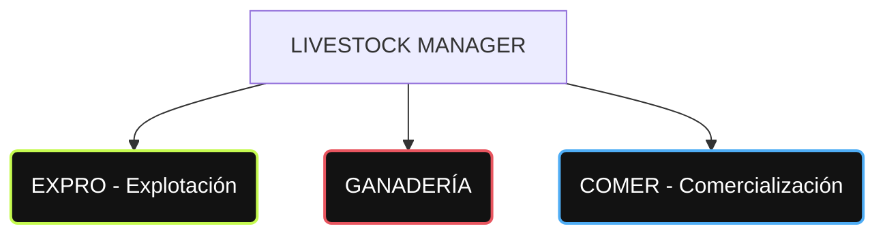

# BRAND DESCRIPTION (Describe Brand) — LIVESTOCK MANAGER

Este documento detalla la identidad, valores, filosofía visual y la arquitectura de colores de **LIVESTOCK MANAGER**, consolidada bajo el estándar corporativo simplificado a un esquema de tres pilares cromáticos para las tres grandes áreas del sistema (**Expro**, **Ganadería**, **Comer**), con colores refinados para los identificadores, textos secundarios y viñetas de estado basados en la muestra **Numeros, texto y viñetas.jpg**.

---

## 1. Posicionamiento e Identidad de Marca

Livestock Manager es una plataforma de software AgTech de vanguardia, diseñada para la digitalización, trazabilidad e industrialización de explotaciones agropecuarias. 

*   **Misión**: Simplificar y automatizar el trabajo diario en el campo mediante interfaces de alto contraste y excelente legibilidad exterior.
*   **Visión**: Romper drásticamente con el software agrícola tradicional, aportando una UX atractiva y estéticamente premium basada en la filosofía **"Dark Pro OLED"** (fondo principal `#0C0C0C` y tarjetas en `#1E1E1E`).

---

## 2. Los Tres Pilares Cromáticos y Tipografía de Soporte

La aplicación divide conceptualmente sus funciones y diseño visual en tres áreas clave, cada una asignada a una paleta neón única derivada de las muestras de diseño (`Lima.jpg`, `RED.jpg`, `Blue.jpg` y el refinamiento de textos de `Numeros, texto y viñetas.jpg`):

### 1. Área de Explotación (Expro) ➔ Verde Lima (`#C5FA50`)
*   **Origen**: `Numeros, texto y viñetas.jpg` (Refinamiento de `Lima.jpg`).
*   **Concepto**: Control de tierras, potreros, instalaciones, loaders y estado de éxito operacional.
*   **Mapeo de UI y Rutas**:
    *   Pantalla de Inicio / Dashboard General (`/`).
    *   Módulo de Zonas y Potreros (`/zonas`, `/zona`).
    *   Loader del sistema y botones primarios de guardado.

### 2. Área de Ganadería ➔ Rojo Coral (`#E8555F`)
*   **Origen**: `Numeros, texto y viñetas.jpg` (Refinamiento de `RED.jpg`).
*   **Concepto**: Registro individual de animales, tratamientos sanitarios, pesajes, carne y gastos operativos directos.
*   **Mapeo de UI y Rutas**:
    *   Fichas de Animales (`/animales`, `/animal`).
    *   Cuaderno Digital de Explotación (`/cuaderno`).
    *   Tratamientos Sanitarios y Reproducción (`/ganaderia`).
    *   Módulo de Carnes (`/carne`).
    *   Gastos directos (`/gastos`, `/gasto`).

### 3. Área de Comercialización (Comer) ➔ Azul / Cyan (`#4FADF5`)
*   **Origen**: `Numeros, texto y viñetas.jpg` (Refinamiento de `Blue.jpg`).
*   **Concepto**: Producción láctea, logística, contratos, compradores, proveedores e informes financieros de comercialización.
*   **Mapeo de UI y Rutas**:
    *   Módulo de Leche (`/leche`, `/albaran-leche`).
    *   Módulo de Ventas e Intermediación (`/comercializacion`).
    *   Listados de Rebaños (`/rebanos`, `/rebano`).
    *   Compradores (`/compradores`, `/comprador`) y Contratos (`/contrato`).
    *   Proveedores (`/proveedores`, `/proveedor`).
    *   Logística y Transportistas (`/transportistas`).
    *   Documentos oficiales e informes financieros (`/documentos`).
    *   Acento secundario/genética (mediante variante de Cyan claro `#7EEFEF` para acentos de reproducción).

---

## 3. Tipografía y Soporte de Datos Fijos

Para dotar de legibilidad extrema a los textos de animales, rebaños, carne y leche en las listas y vistas:

*   **Identificadores Principales y Cifras Destacadas (Oro) ➔ `#FFFC55`**
    *   Utilizado para códigos de crotales, números de albarán, volumen de producción (litros, kg) e importes financieros destacados en los listados.
    *   Aporta un tono dorado/amarillo brillante de alto impacto visual sin emitir glow distractivo.
*   **Textos Secundarios y Etiquetas de Soporte (Gris Acero) ➔ `#B1B1B1`**
    *   Utilizado para etiquetas aclaratorias (ej. `cab.`, `kg`, `€`, `nif`) y metadatos complementarios en las cards.
    *   Garantiza que la información secundaria pase a un segundo plano visual y no compita con los datos destacados en oro y los colores del área.
*   **Viñetas de Estado Iluminadas**
    *   Formato cápsula horizontal alineado a la derecha. Utilizan el fondo al `15%` de opacidad de su respectivo color neón de área, con un borde al `40%` y un drop-shadow sutil para simular retroiluminación en las pantallas OLED.
