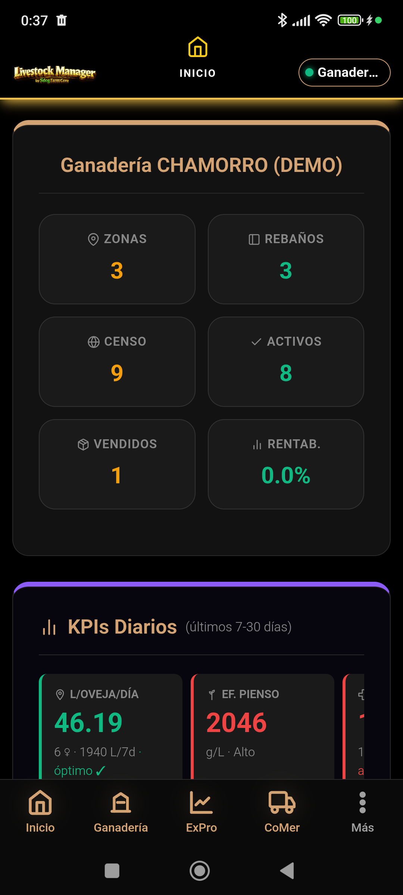
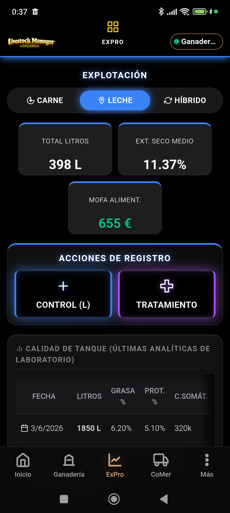
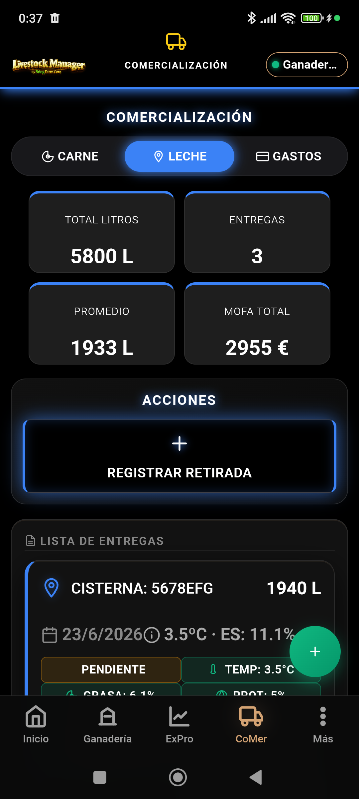
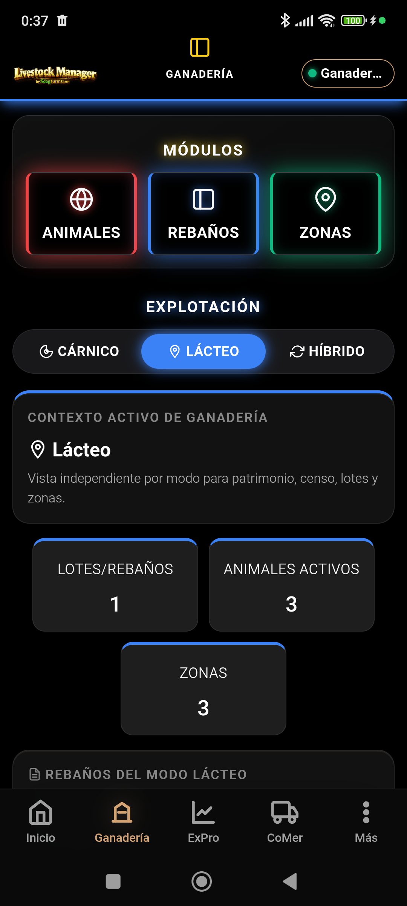
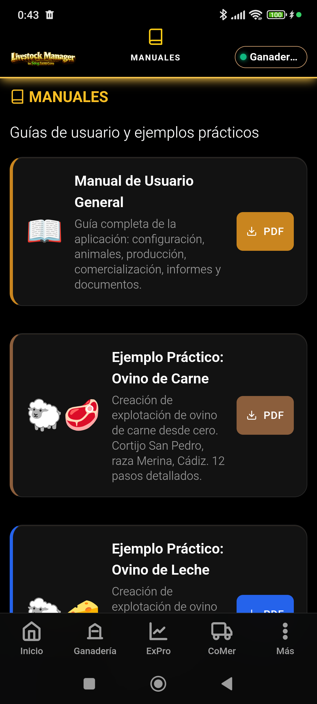
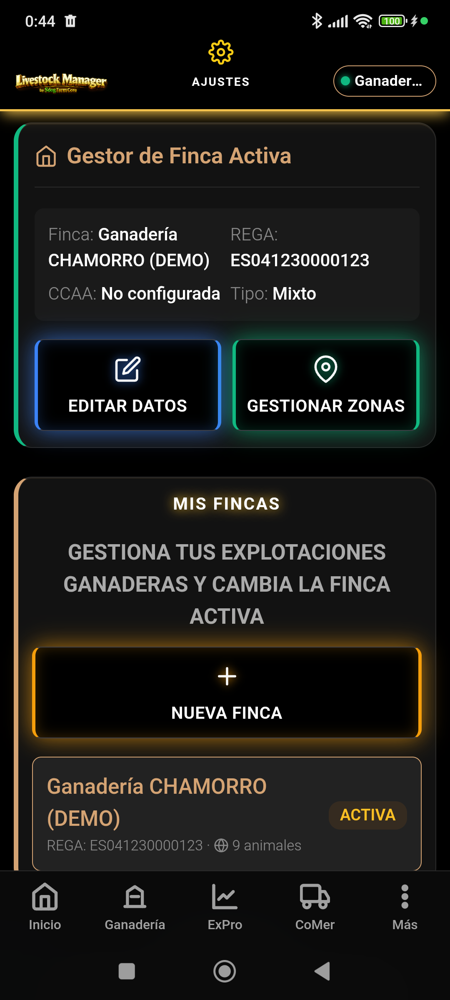
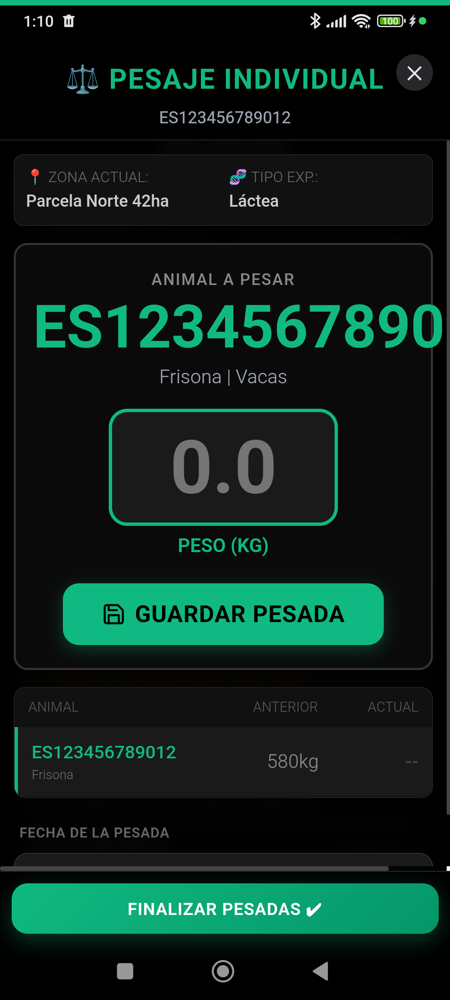
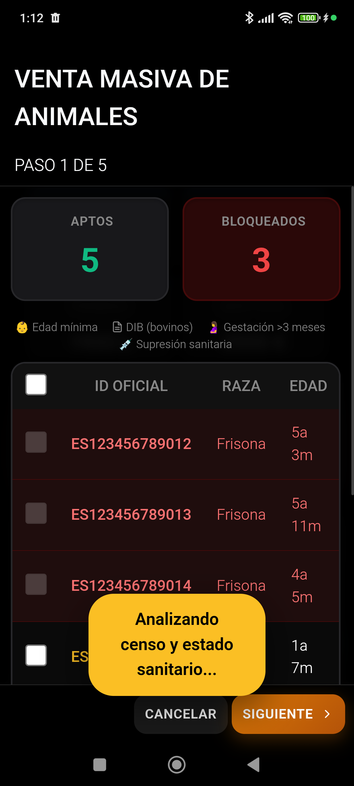
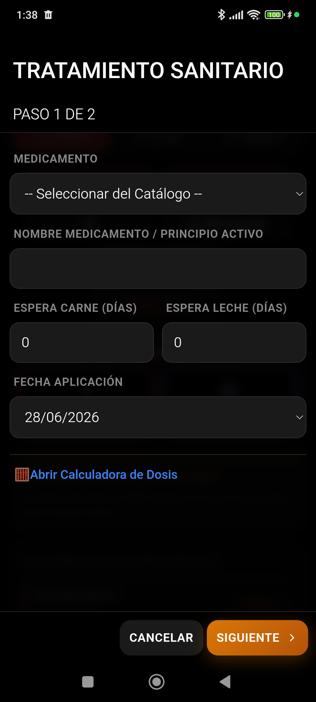
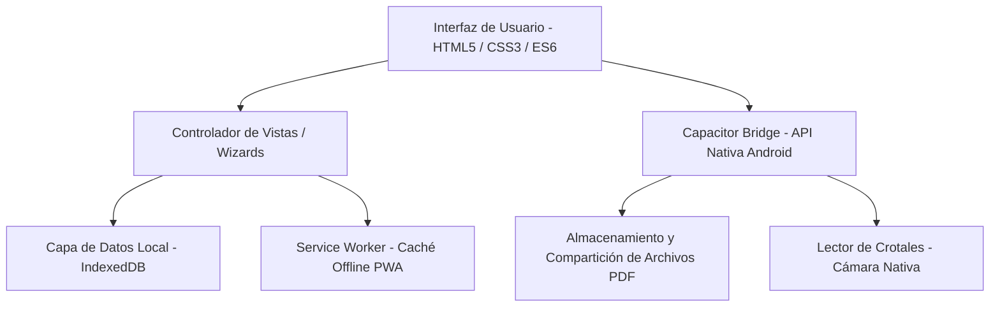

# Livestock Manager Premium

Plataforma profesional de gestión ganadera diseñada para optimizar la operativa de campo, garantizar el cumplimiento normativo oficial y agilizar la toma de decisiones financieras y comerciales. Adaptada estrictamente a la normativa legal española (RD 787/2023) y a los marcos autonómicos SIGGAN (Andalucía) y BADIGEX (Extremadura).

---

## 1. Galería de la Aplicación

A continuación se presentan capturas de pantalla de la interfaz de usuario de Livestock Manager correspondientes a la versión v4.8.7:

| Panel de Inicio | Gestión de Fincas | Comercialización |
| :---: | :---: | :---: |
|  |  |  |

| Panel Ganadero | Visor de Manuales | Ajustes del Sistema |
| :---: | :---: | :---: |
|  |  |  |

| Asistente de Pesajes | Venta Masiva de Carne | Tratamientos Sanitarios |
| :---: | :---: | :---: |
|  |  |  |

---

## 2. Características Principales

### Gestión de Explotaciones y Fincas
* Configuración de datos del código REGA oficial de la explotación ganadera.
* Segmentación territorial por Fincas, Zonas de pasto y Rebaños individuales.
* Control analítico de costes fijos y variables imputables por lote o animal.

### Censo Ganadero y Trazabilidad 360
* Identificación individualizada de cabezas de ganado por crotales oficiales.
* Historial cronológico interactivo (Timeline de vida del animal): nacimientos, pesajes, tratamientos, traslados y ventas.
* Integración con escáneres de cámara y lectores de mano para crotales mediante códigos de barras y códigos QR.

### Registro Oficial y Cuaderno Digital (RD 787/2023)
* Generación automatizada del Cuaderno Digital Ganadero unificando censo, libro de tratamientos veterinarios, movimientos y bajas.
* Validación previa de consistencia ganadera para auditorías.
* Exportación oficial en formato PDF y compartición nativa mediante el sistema de archivos de Capacitor.

---

## 3. Arquitectura Técnica

La plataforma se ha desarrollado bajo una arquitectura PWA híbrida de alto rendimiento optimizada para su ejecución offline en zonas rurales sin conectividad:



### Tecnologías Clave:
* **Frontend Core:** HTML5 semántico, CSS3 estructurado (Outfit Font System) y JavaScript ES6 modular libre de dependencias externas pesadas.
* **Persistencia:** Base de datos IndexedDB local de alta capacidad (sincronizada en segundo plano).
* **Motor Offline:** Service Worker con precarga de recursos estáticos y vistas para soporte offline del 100% de la funcionalidad.
* **Hibridación:** Capacitor v5 con plugins nativos para cámara (barcode-scanner), sistema de archivos y compartición nativa (Share API).

---

## 4. Estructura del Proyecto

```text
.
├── index.html                   # Página principal de la aplicación (SPA)
├── manifest.webmanifest         # Configuración PWA para instalación web
├── sw.js                        # Service Worker de gestión de caché offline
├── css/                         # Hojas de estilo globales
├── js/                          # Lógica y controladores de la aplicación
│   ├── database.js              # Inicialización y persistencia de IndexedDB
│   ├── icons.js                 # Biblioteca de iconos SVG vectoriales
│   ├── views/                   # Controladores de las pantallas de la SPA
│   │   ├── manuales-view.js     # Visor integrado de guías de usuario
│   │   └── wizards/             # Flujos paso a paso de tareas críticas
│   └── qa-siggan.js             # Batería de pruebas automatizadas QA
├── icons/                       # Recursos gráficos e imágenes de marca de la app
├── manual/                      # Directorio fuente de manuales en HTML
│   ├── estilo-manuales.css      # CSS centralizado de los manuales
│   └── img/                     # Capturas de pantalla de soporte ilustrativo
├── scripts/                     # Scripts auxiliares y herramientas de compilación
├── android/                     # Proyecto nativo compilable de Android Studio
└── package.json                 # Definición de dependencias y scripts de construcción
```

---

## 5. Instalación y Construcción

### Requisitos Previos:
* Node.js v18.0 o superior.
* npm v9.0 o superior.
* Android Studio (con Android SDK 33+).
* JDK 17 o superior.

### Configuración del Entorno:
1. Clonar el repositorio localmente.
2. Instalar las dependencias de Node.js:
   ```bash
   npm install
   ```

### Scripts de Compilación:
* **Construcción Web:** Compila y copia todos los archivos web necesarios al directorio de producción `www`:
  ```bash
  npm run build
  ```
* **Sincronización con Android:** Compila el proyecto web y sincroniza todos los recursos con la carpeta nativa de Android Assets:
  ```bash
  npm run cap:sync
  ```
* **Apertura en Android Studio:** Abre la consola de desarrollo de Android Studio apuntando al proyecto móvil:
  ```bash
  npm run cap:open
  ```

---

## 6. Pruebas de Calidad (QA) y Consistencia

La aplicación incluye un completo suite de diagnóstico funcional en `js/qa-siggan.js` ejecutable directamente desde la consola de desarrollador del navegador web o del dispositivo:

```js
// Ejecutar el suite completo de pruebas
await SigganQA.runAll();

// Validar la cobertura del modelo de datos de trazabilidad
await SigganQA.run("coverage");

// Limpiar registros temporales de pruebas
await SigganQA.cleanup();
```

Adicionalmente, se pueden correr chequeos específicos de la app a través del módulo de testeo básico:
* `window.QATestRunner.runAll()`: Pruebas unitarias de flujo.
* `window.QADiagnostico.run()`: Evaluación de consistencia interna del almacenamiento IndexedDB.

---

## 7. Licencia

Repositorio privado. Todos los derechos reservados. Uso exclusivo interno del proyecto Livestock Manager.
