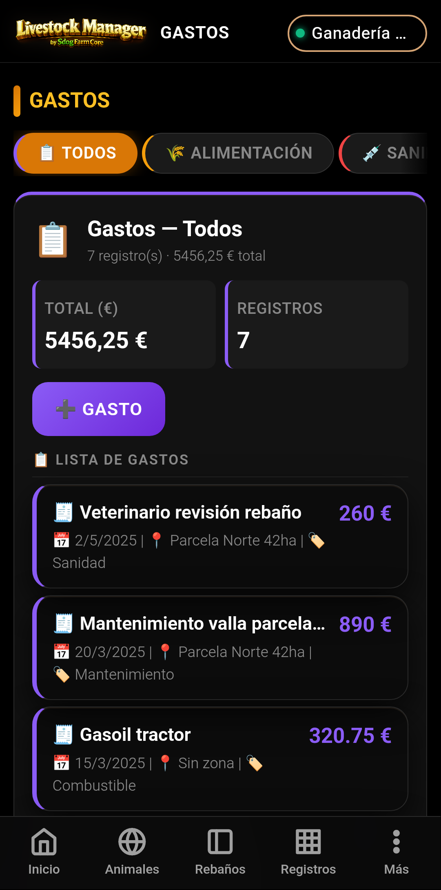
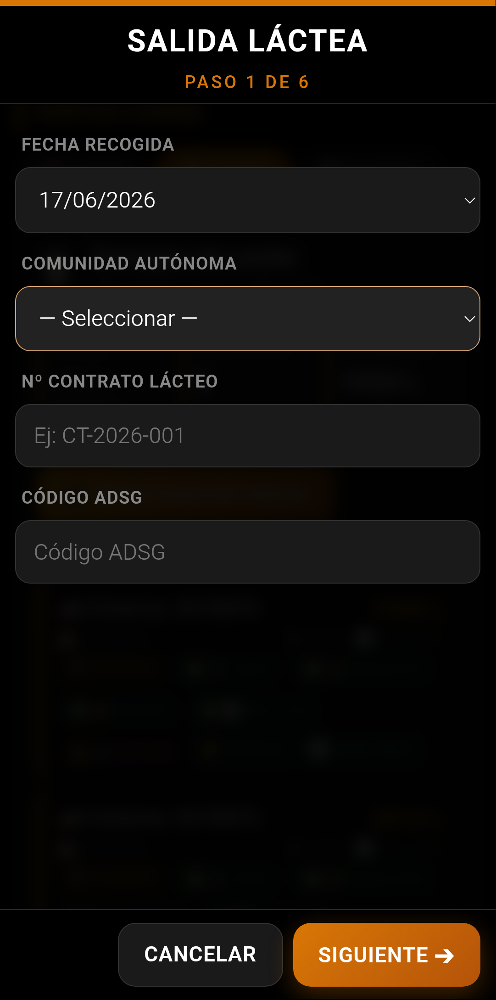
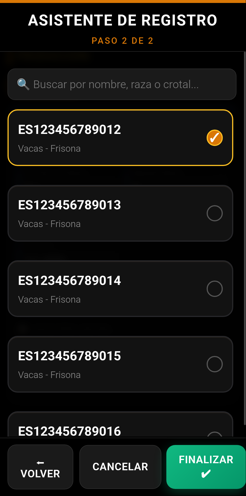
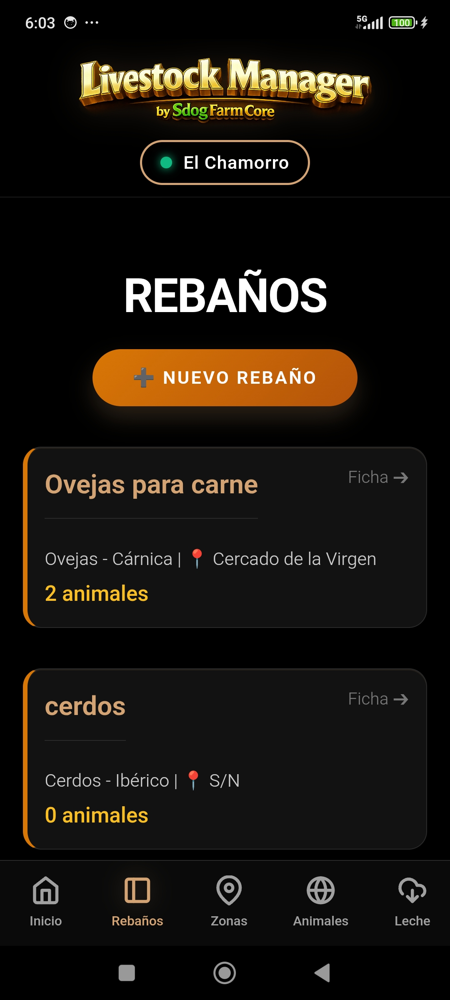
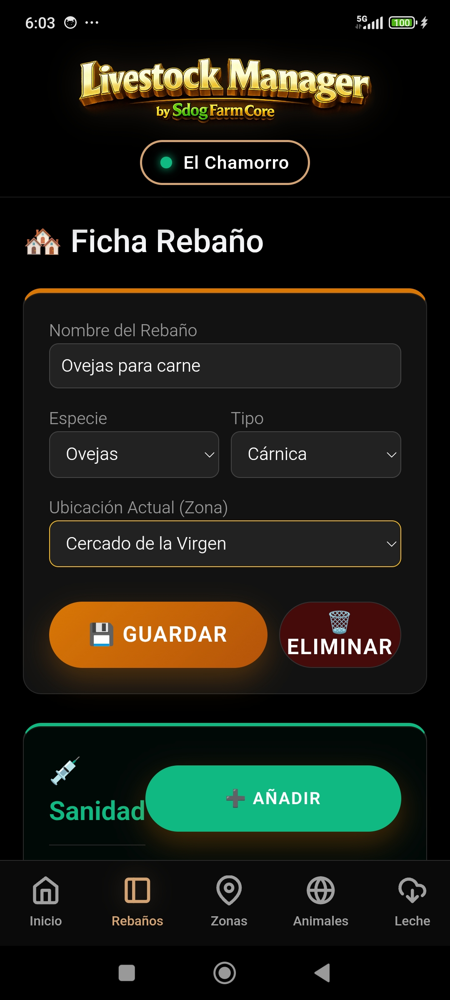

<div align="center">
  
</div>

# Livestock Manager Premium

Sistema profesional e independiente de gestión ganadera diseñado para optimizar la trazabilidad, el cumplimiento normativo de seguridad alimentaria y la contabilidad analítica en explotaciones industriales. Optimizado para dispositivos Android mediante **Capacitor**.

<div align="center">
  
  
  
</div>

---

## 📘 Manuales de Usuario Integrados

La app incluye **8 manuales de usuario** en HTML con capturas de pantalla reales, accesibles desde **Ajustes → 📚 Manuales**. Cada manual documenta paso a paso los wizards y funcionalidades:

| Manual | Descripción | Capturas |
|--------|-------------|----------|
| 📖 **Manual General** | Guía completa de la aplicación (17 secciones) | 15 |
| 🐑🥩 **Ovino de Carne** | Ejemplo práctico: Cortijo San Pedro, raza Merina | 12 |
| 🐑🧀 **Ovino de Leche** | Ejemplo práctico: Quesería Los Llanos, raza Manchega | 14 |
| 📊 **Registros de Producción** | Pesajes, GMD, control lechero, analíticas, MOFA | 19 |
| 💰 **Comercialización** | Venta Masiva (5 pasos) + Albarán Leche (6 pasos) | 8 |
| ⚖️ **Pesadas** | Individual animal y por lote de rebaño | 6 |
| 🥛 **Control Lechero** | Individual, lote y expedición de tanque | 12 |
| 💰 **Gastos** | Control de costes analítico por categorías | 5 |

Los manuales se visualizan dentro de la propia app y se pueden **exportar a PDF** desde el botón de cada manual.

---

## 🚀 Características Principales

<div align="center">
  
  
  
</div>

### 📄 Centro de Informes Premium (14 Tabs)

El módulo de informes se ha expandido con **5 nuevos tipos de informe** (14 tabs totales) que proporcionan una visión analítica completa de la explotación:

| Tab | Descripción |
|-----|-------------|
| 📊 **General** | Resumen económico y balances |
| 🥩 **Cárnico** | Ventas de carne con desglose por rebaño |
| 🥛 **Lácteo** | Control lechero con producción por rebaño |
| 🐑 **Reproductivo** | Eventos reproductivos |
| 💊 **Sanidad** | Tratamientos y retenciones |
| 🐄 **Censo** | Censo de rebaños y animales |
| 💰 **Ventas** | Todas las ventas agregadas |
| 🏢 **Compradores** *(nuevo)* | Agrupación de ventas por comprador, KPIs, top 5 |
| 📦 **Proveedores** *(nuevo)* | Gastos agrupados por proveedor, categorías, doughnut |
| 🧪 **Fitosanitario** *(nuevo)* | Gastos fitosanitarios + tratamientos, línea temporal |
| 🚨 **Alertas** *(nuevo)* | Alertas activas sanitarias, trazabilidad, administrativas |
| 🏠 **Por Finca** *(nuevo)* | Ficha completa de explotación + resumen económico |
| 📋 **REGA** | Libro sanitario oficial |
| 📤 **Exportar** | Exportación PDF y Excel |

**Nuevos métodos helper** en `analitica.js`:
- `obtenerResumenCompradores()` — estadísticas agregadas de compradores
- `obtenerResumenProveedores()` — estadísticas agregadas de proveedores
- `obtenerGastosFitosanitarios()` — gastos fitosanitarios con desglose

**Exportación Excel** mejorada con 2 hojas adicionales: Compradores y Proveedores.

**Mejoras en tabs existentes:**
- Cárnico: sub-sección "Rentabilidad por rebaño"
- Lácteo: sub-sección "Producción por rebaño"

### 🥛 Módulo Lácteo Integral + Normativas Autonómicas

Integración completa del flujo lácteo con todas las exigencias normativas de Andalucía y Extremadura para ovino de leche:

- **Servicio de Comunidades Autónomas** con constantes autonómicas, plataformas (SIGGAN / BADIGEX) y umbrales PAC diferenciados.
- **Gestión de finca mejorada** con campos de comunidad autónoma, tipo/sistema de explotación, ADSG, contrato lácteo e INFOLAC.
- **Wizard Albarán Leche (6 pasos):**
  1. Fecha + CCAA + Contrato + ADSG
  2. Matrícula cisterna + Letra Q + INFOLAC
  3. Cadena de frío (temperatura, inhibidores)
  4. Laboratorio (grasa%, proteína%, UFC, somáticas)
  5. Pricing (precio base, primas/penalizaciones)
  6. MOFA y resumen final
- **Cálculos automáticos:** Extracto seco, precio final, MOFA.
- **Albarán PDF enriquecido** con trazabilidad, laboratorio y desglose económico.
- **Vista Control Lechero** (5 tabs): Todas, Producción, Analíticas, Liquidaciones, MOFA.
- **Indicadores lácteos en Dashboard:** MOFA mensual, precio medio €/L, extracto seco medio.

### 💰 Módulo de Comercialización

- **Wizard Venta Masiva (5 pasos):**
  1. Selección de animales con censo y estado sanitario
  2. Trazabilidad (fecha, matadero, ICA, guía)
  3. Pesos y costes (peso vivo, canal, gastos)
  4. Comprador + Clasificación SEUROP (S/E/U/R/O/P)
  5. Transportista + Autorización Veterinaria
- Generación automática de **albarán, DIMOE y factura**.

### ⚖️ Pesaje Industrial

- **Pesada Individual:** Seguimiento individualizado con cálculo de GMD.
- **Pesaje por Lote:** Tabla de pesos para todo el rebaño en una sola operación.
- Interfaz full-screen con feedback visual, teclado numérico forzado y flujo continuo.
- **Cálculo automático de Ganancia Media Diaria (GMD).**

### 📊 KPIs Diarios y Alarmas

Tres indicadores clave calculados desde los datos registrados:
- **🥛 Litros / Oveja / Día:** Media de producción por hembra activa (7 días).
- **🌾 Eficiencia de Pienso:** Gramos de pienso por litro producido.
- **🩺 % Bajas por Mamitis:** Porcentaje con tratamiento en últimos 30 días.

**Sistema de Alarmas Unificado** con 4 categorías:
- 🔴 **Alertas Sanitarias:** Periodos de supresión activos.
- 🟠 **Alertas de Trazabilidad:** Identificación y notificación REGA pendientes.
- 🟣 **Alertas Administrativas:** Contrato lácteo, INFOLAC, PAC, ADSG.
- 🔵 **Calendario Preventivo:** Recomendaciones estacionales.

### 💊 Guía Farmacológica Interactiva

Overlay completo con:
- **Tabla de retiros** de 31 fármacos en 7 categorías (antiparasitarios, antibióticos, antiinflamatorios, anestésicos, suplementos, biológicos, antimicóticos).
- **Buscador en vivo** + filtros rápidos por categoría.
- **Calculadora de dosificación:** V = (P × D) / C con actualización en vivo.

### 📋 Módulo de Gastos Analítico

- **Wizard de gasto** con campos dinámicos según categoría contable.
- **Imputaciones:**

| Categoría | Imputación | Ejemplo |
|-----------|-----------|---------|
| 🌾 Alimentación | Rebaño | Piensos, forrajes |
| 💉 Sanidad | Rebaño | Vacunas, veterinario |
| ⚡ Electricidad | Zona | Factura de luz |
| 🌱 Fitosanitarios | Zona | Herbicidas |
| 👷 Personal | General finca | Nóminas |
| 🚜 Amortización | General finca | Maquinaria |

- Visualización por **tabs de categorías** con KPIs.
- Integración en **Informes de rentabilidad** con balance ingresos/gastos.

### 🔗 Trazabilidad 360°

- Validación en tiempo real de **aforo** (capacidad por zona).
- **Regla de seguridad alimentaria:** Bloqueo de venta si hay tratamiento activo.
- **Regla de mermas:** Peso canal < peso vivo siempre.
- Histórico completo de nacimientos, compras, ventas y movimientos.

### ⚙️ Pantalla de Ajustes

La vista de ajustes incluye ahora:
- **Logo de la aplicación** en lugar de texto — imagen oficial en el footer
- **Créditos del desarrollador:** David Asuar Arteaga
- **Enlace al repositorio GitHub:** [github.com/SADOCKDOG/LIVESTOCK-MANAGER](https://github.com/SADOCKDOG/LIVESTOCK-MANAGER)
- **Información de licencia:** Uso privado — prohibida la redistribución sin autorización expresa
- **Versión actual:** v4.4.0

---

<div align="center">
  
  
  
</div>

---

## 🏗️ Arquitectura Técnica

```
www/
├── js/
│   ├── services/
│   │   ├── comunidades-service.js   # Constantes CCAA, umbrales calidad
│   │   ├── event-bus.js             # Sistema pub/sub entre módulos
│   │   ├── cache-service.js         # Caché en memoria con TTL
│   │   ├── alertas-service.js       # Alarmas unificadas (4 categorías)
│   │   ├── balance-service.js       # Cálculos de rentabilidad
│   │   └── snapshot-service.js      # Contexto histórico para producción
│   ├── views/
│   │   ├── dashboard-view.js        # Dashboard con KPIs + alarmas
│   │   ├── animales-view.js         # Gestión de animales
│   │   ├── zonas-view.js            # Zonas/parcelas con aforo
│   │   ├── rebanos-view.js          # Gestión de rebaños
│   │   ├── produccion-view.js       # Registros producción cárnica/láctea
│   │   ├── leche-view.js            # Control lechero (5 tabs)
│   │   ├── gastos-view.js           # Gastos analíticos por categorías
│   │   ├── comercializacion-view.js # Ventas carne/leche/gastos
│   │   ├── informes-view.js         # Informes analíticos (14 tabs)
│   │   ├── contratos-view.js        # Gestión de contratos
│   │   ├── ajustes-view.js          # Configuración + guía farmacológica
│   │   ├── cuaderno-view.js         # Cuaderno digital RD 787/2023
│   │   ├── documentos-view.js       # Documentos legales
│   │   ├── manuales-view.js         # Visor de manuales de usuario
│   │   ├── ayudante-view.js         # Asistente de producción
│   │   └── fincas-view.js           # Gestión de fincas
│   ├── views/wizards/
│   │   ├── wizard-venta-masiva.js   # Venta masiva (5 pasos)
│   │   ├── wizard-albaran-leche.js  # Albarán leche (6 pasos)
│   │   ├── wizard-traslado.js       # Traslado de animales
│   │   ├── wizard-tratamiento.js    # Tratamiento sanitario
│   │   ├── wizard-crotales.js       # Pedido de crotales
│   │   ├── wizard-finca.js          # Creación/edición de finca
│   │   ├── wizard-gasto.js          # Gasto analítico
│   │   └── wizard-manager.js        # Gestor de wizards multi-paso
│   ├── views/helpers/
│   │   ├── calidad-leche.js         # Badges calidad láctea
│   │   └── ayuda.js                 # Helpers de interfaz
│   ├── app.js                       # Controlador principal (~4082 líneas)
│   ├── db.js                        # IndexedDB v9
│   ├── analitica.js                 # Cálculos financieros + 3 helpers
│   ├── pesadas.js                   # Pesajes y seguimiento
│   ├── pesajes-ui.js                # UI de pesajes individual/lote/tanque
│   ├── produccion-ui.js             # Asistente de producción maestro
│   ├── animales.js                  # CRUD animales con validaciones
│   ├── rebanos.js                   # CRUD rebaños
│   ├── zonas.js                     # CRUD zonas
│   ├── fincas.js                    # CRUD fincas
│   ├── gastos.js                    # CRUD gastos
│   ├── informes.js                  # Generación informes
│   ├── reportes.js                  # Reportes analíticos
│   ├── trazabilidad.js              # Motor de reglas y albaranes PDF
│   ├── export.js                    # Exportación datos
│   ├── pdf-import.js                # Importación PDF
│   ├── reproduccion.js              # Gestión reproductiva
│   ├── seed-zonas.js                # Datos semilla zonas
│   └── idb-local.js                 # Utilidades IndexedDB
├── manual/
│   ├── index.html                   # Manual de usuario general
│   ├── ejemplo-ovino-carne.html     # Ejemplo práctico carne
│   ├── ejemplo-ovino-leche.html     # Ejemplo práctico leche
│   ├── registros-produccion.html    # Registros de producción
│   ├── manual-comercializacion.html # Comercialización
│   ├── manual-pesadas.html          # Pesadas individual/lote
│   ├── manual-control-lechero.html  # Control lechero
│   ├── manual-gastos.html           # Gastos
│   └── img/                         # Capturas (91 imágenes)
├── icons/
│   ├── Logo aplicación.png          # Logo oficial
│   ├── Icono de aplicación.png      # Icono app
│   ├── Logo SDOGFARMCORE.png        # Logo corporativo
│   ├── logo-header.png              # Logo para cabecera
│   └── icon-192.png / icon-512.png  # PWA icons
├── css/
│   └── styles.css                   # Estilos globales
├── index.html                       # Entry point
└── sw.js                            # Service Worker (corcho-v6.5.8)
```

### Principios de diseño

- **Local-First:** Base de datos IndexedDB para funcionamiento 100% offline.
- **Arquitectura Modular:** 15+ vistas independientes en `js/views/` con EventBus para comunicación entre módulos.
- **Refactorización progresiva:** app.js reducido de ~5248 a ~4082 líneas con wizards y vistas extraídos.
- **Hash-based routing:** Navegación SPA mediante `window.location.hash`.
- **Service Worker:** Caché de assets para arranque instantáneo (versión actual: `corcho-v6.5.8`).

---

## 🛠️ Instalación y Desarrollo

1. **Requisitos:** Node.js, npm, Android Studio, JDK 17+.
2. **Clonar:** `git clone https://github.com/SADOCKDOG/LIVESTOCK-MANAGER.git`
3. **Dependencias:** `npm install`
4. **Sincronización Android:** `npm run cap:sync`
5. **Build APK:** `cd android && gradlew.bat assembleDebug`

### Flujo de trabajo

```
Editar en www/ → Sincronizar 4 espejos → node --check → Build APK → Instalar en dispositivo
```

Los 4 espejos son:
- `www/` (fuente de verdad)
- `android/app/src/main/assets/public/`
- `android/app/build/intermediates/assets/debug/mergeDebugAssets/public/`
- Raíz del proyecto (sw.js, index.html y manifest.webmanifest)

---

## 🔄 Refactorización JS (Fase 2 completada)

| Componente | Antes | Después |
|------------|:-----:|:-------:|
| app.js | 5248 líneas | ~4082 líneas |
| Vistas extraídas | ~17 | 15+ |
| Wizards extraídos | 3 | 8 |
| Código muerto eliminado | ~400 líneas | ✓ |

### Últimas incorporaciones (v4.4.0)

| Módulo | Cambio |
|--------|--------|
| 📄 **Informes** | +5 nuevos tabs: Compradores, Proveedores, Fitosanitario, Alertas, Por Finca |
| 📊 **Exportación Excel** | +2 hojas: Compradores y Proveedores |
| 📈 **analitica.js** | +3 métodos helpers de agregación |
| ⚙️ **Ajustes** | Logo app, créditos desarrollador, licencia, enlace GitHub |
| 🏗️ **Versionado** | App v4.4.0, SW corcho-v6.5.8, DB v9 |

---

## 📄 Licencia y Soporte

© 2026 Livestock Manager Premium · v4.4.0. Todos los derechos reservados.

**Desarrollado por David Asuar Arteaga**

- **Repositorio:** [github.com/SADOCKDOG/LIVESTOCK-MANAGER](https://github.com/SADOCKDOG/LIVESTOCK-MANAGER)
- **Email:** [soporte.sdogfarm@gmail.com](mailto:soporte.sdogfarm@gmail.com)

*Licencia: Uso privado — Prohibida la redistribución sin autorización expresa del desarrollador.*
