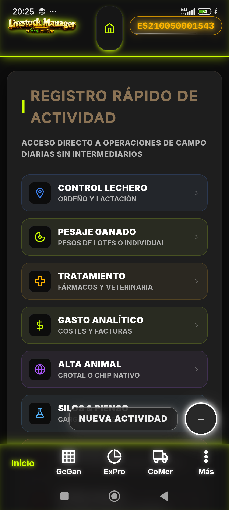
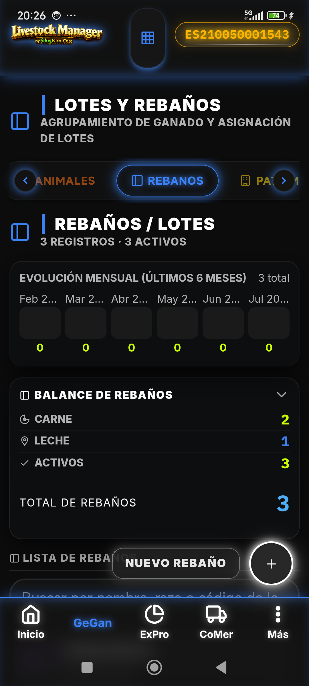
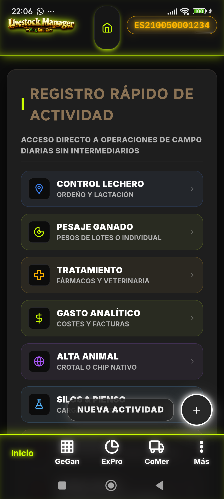
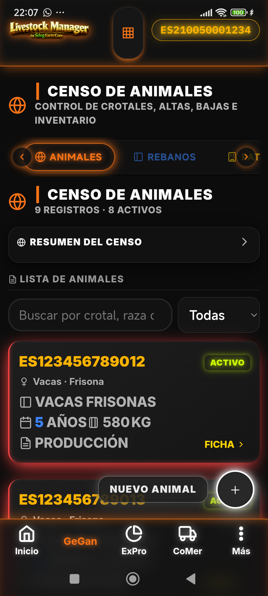
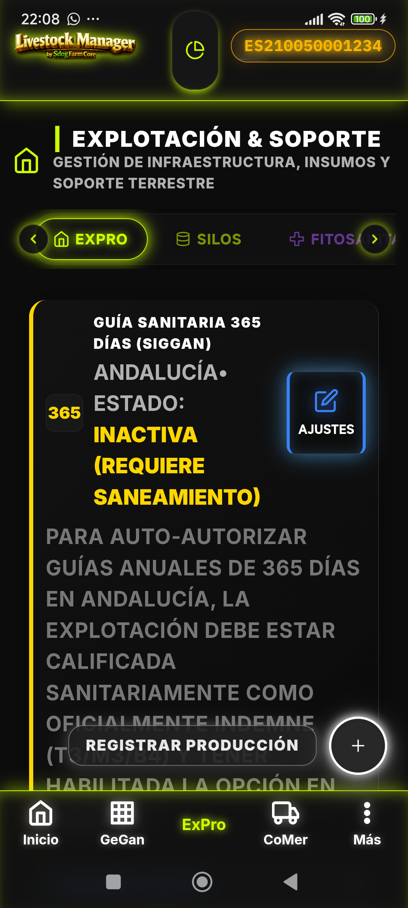
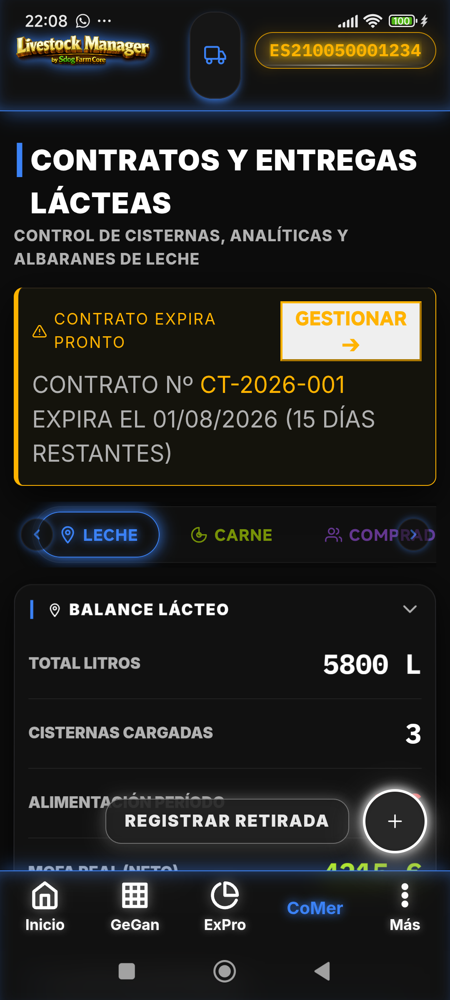
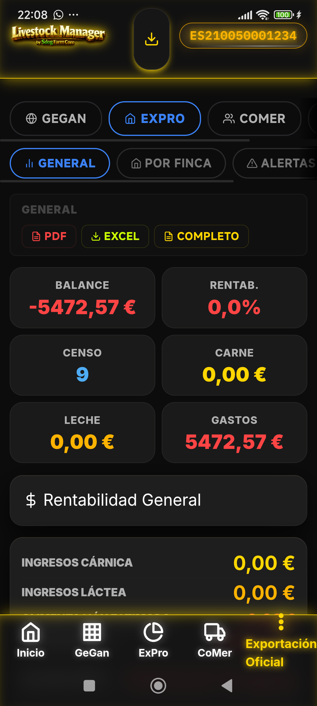
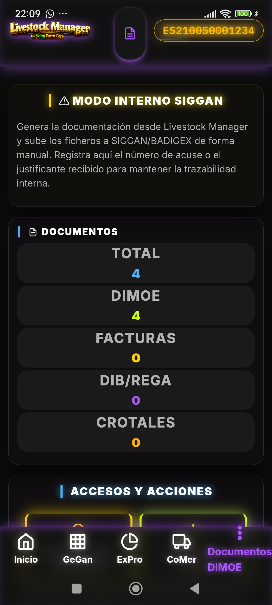
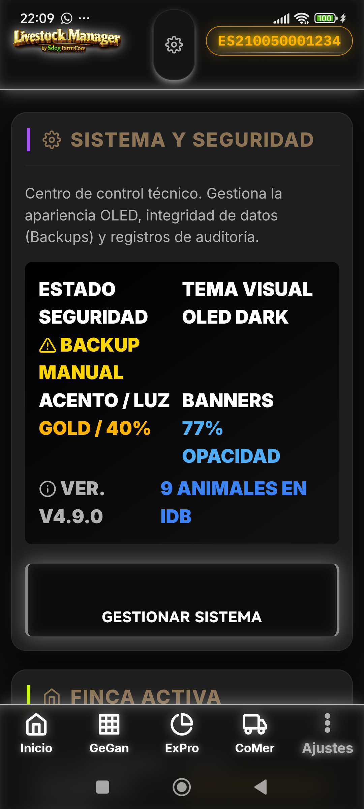

<p align="center">
  
</p>

<h1 align="center">Livestock Manager Premium</h1>
<h3 align="center">Sistema Integral de Gestión Ganadera · v4.10.1</h3>

<p align="center">
  PWA híbrida (Android · Capacitor 7) 100% <strong>offline-first</strong> para la gestión profesional de explotaciones ganaderas, con cumplimiento normativo nativo del sistema <strong>SIGGAN</strong> (Andalucía) y <strong>BADIGEX</strong> (Extremadura).
</p>

<p align="center">
  <a href="#multi-explotación">Multi-Explotación</a> ·
  <a href="#módulos-y-funcionalidades">Módulos</a> ·
  <a href="#integración-siggan--badigex">SIGGAN / BADIGEX</a> ·
  <a href="#arquitectura-técnica">Arquitectura</a> ·
  <a href="#instalación-y-desarrollo">Instalación</a> ·
  <a href="#free--premium">Free / Premium</a>
</p>

---

## Descripción General

**Livestock Manager** es una plataforma de gestión ganadera de grado industrial pensada para el día a día del ganadero: censo y trazabilidad animal, producción (carne y leche), comercialización, sanidad, finanzas y documentación oficial — todo funcionando **sin conexión** en el terreno, con sincronización y exportación cuando procede.

La aplicación no es un CRM genérico adaptado al sector: su modelo de datos y sus flujos de trabajo están construidos directamente sobre la normativa española y autonómica de identificación y movimiento de ganado (RD 787/2023, RD 479/2004, Reg. UE 1069/2009), con los sistemas oficiales de gestión ganadera de **Andalucía (SIGGAN)** y **Extremadura (BADIGEX)** como referencia de diseño.

<p align="center">
  
</p>

---

## Multi-Explotación

Livestock Manager gestiona **varias explotaciones (fincas) de forma simultánea** desde una misma instalación, y cada una es completamente independiente en cuanto a datos y configuración:

- **Cambio de finca activa** en un clic desde Ajustes, sin perder el contexto de trabajo.
- **Tipo de explotación por finca — Lácteo / Cárnico / ambos.** Cada finca declara qué produce mediante dos *flags* independientes (`leche`, `carne`); no existe un tercer estado "híbrido" artificial: si una finca tiene ambos activos, cada módulo muestra sus secciones de leche y de carne **por separado**, nunca fusionadas.
  - El tipo de explotación se pregunta directamente en el asistente de alta de una finca nueva.
  - Toda la interfaz reacciona a ese tipo: el Dashboard, Comercialización, Animales, Rebaños, Informes y la barra de navegación ocultan o muestran secciones según lo que esa finca concreta produce — sin intervención manual en cada módulo.
  - Un banner discreto avisa cuando hay registros ocultos por el tipo de explotación configurado (nunca oculta datos de forma silenciosa).
  - Las alertas de **seguridad alimentaria** (periodos de supresión sanitaria en leche y carne) se muestran siempre, con independencia del tipo de explotación activo.
- **Datos aislados por finca:** rebaños, animales, producción, sanidad, comercialización y documentación oficial cuelgan siempre de la finca a la que pertenecen — cambiar de finca activa nunca mezcla datos entre explotaciones.
- **Datos REGA/CEA independientes** por finca (código REGA, CCAA, ADSG, zonas y parcelas, contrato lácteo), lo que permite operar explotaciones en distintas comunidades autónomas (p. ej. una en Andalucía bajo SIGGAN y otra en Extremadura bajo BADIGEX) desde la misma app.

---

## Módulos y Funcionalidades

La aplicación se organiza en pilares interconectados que cubren todas las áreas críticas de una explotación ganadera profesional. Los módulos principales utilizan códigos internos abreviados: **GeGAn** (Ganadería y Animales), **ExPro** (Explotación y Producción) y **CoMer** (Comercialización).

### Dashboard
Panel de control con KPIs en tiempo real, accesos rápidos y alertas prioritarias. Filtra automáticamente según el tipo de explotación activa (leche/carne).

<p align="center">
  
</p>

### Ganadería y Animales (GeGAn)
- Censo completo con trazabilidad individual (crotal, DIB, pedigree)
- Gestión de partos, celos y tratamientos reproductivos
- Historial clínico completo por animal
- Gestión de rebaños y lotes

<p align="center">
  
</p>

### Producción Lechera — ExPro: Leche (módulo condicional)
- Registro de ordeños individuales y por lote
- Control de calidad leche (grasa, proteína, células somáticas)
- Gestión de cuotas y contratos lácteos
- Alertas de periodos de espera post-tratamiento

<p align="center">
  
</p>

### Producción Cárnica — ExPro: Carne (módulo condicional)
- Registro de engorde y conversión alimenticia
- Control de prácticas de bienestar animal
- Trazabilidad completa desde nacimiento hasta sacrificio
- Gestión de lotes de cebo y fechas de salida previstas

<p align="center">
  
</p>

### Sanidad y Tratamientos
- Libro de tratamientos veterinarios con tiempos de espera automáticos
- Gestión de vacunaciones, desparasitaciones y profilaxis
- Alertas de periodos de supresión (SIGGAN/BADIGEX)
- Historial sanitario completo por animal y lote

<p align="center">
  
</p>

### Finanzas y Gastos
- Control de ingresos y gastos por categoría
- Gestión de facturas y albaranes
- Control de subvenciones y ayudas PAC
- Análisis de rentabilidad por producción y animal

<p align="center">
  
</p>

### Comercialización (CoMer)
- Gestión de ventas de animales, leche y subproductos
- Gestión de compras de ganado y piensos
- Control de proveedores y transportistas
- Generación automática de documentación de transporte

<p align="center">
  
</p>

### Documentación Oficial
- Generación automática de guías de movimiento oficiales
- Libro de registro de explotación (registro de eventos)
- Libro de tratamientos veterinarios
- Libro de piensos y medicamentos
- Exportación a formatos oficiales SIGGAN/BADIGEX

<p align="center">
  
</p>

### Informes y Analítica
- Informes de producción (leche/carne) por periodo
- Informes sanitarios y tratamientos
- Informes financieros y de rentabilidad
- Informes de cumplimiento normativo
- Exportación a PDF/CSV para presentación oficial

<p align="center">
  
</p>

### Herramientas y Asistentes
- Asistentes guiados (wizards) para operaciones complejas:
  - Alta de finca y animales
  - Movimientos oficiales (entradas/salidas)
  - Traslados internos y aforo de zonas
  - Tratamientos veterinarios
  - Nacimientos y gestiones reproductivas
  - Ventas masivas y lotes
- Manuales de usuario integrados y actualizables

<p align="center">
  
</p>

### Ajustes y Configuración
- Gestión de múltiples fincas y cambio de contexto
- Configuración de tipo de explotación (leche/carne)
- Gestión de usuarios y permisos
- Configuración de impresión y exportación
- Gestión de actualizaciones y mantenimiento

<p align="center">
  
</p>

---

## Integración SIGGAN / BADIGEX

Livestock Manager está diseñado desde cero para cumplir con los requisitos normativos de los sistemas oficiales de gestión ganadera:

### SIGGAN (Andalucía)
- ✅ Formato REGA validado según RD 479/2004
- ✅ Gestión completa de movimientos oficiales con guías de origen y sanitarias
- ✅ Libro de tratamientos con tiempos de espera automáticos (carne/leche)
- ✅ Gestión de zonas, UGM y carga ganadera
- ✅ Exportación oficial de documentos en formatos compatibles
- ✅ Alertas de periodos de supresión SANDACH
- ✅ Trazabilidad completa desde nacimiento hasta destino final

### BADIGEX (Extremadura)
- ✅ Adaptación completa al marco normativo extremeño
- ✅ Formatos de exportación e importación compatibles
- ✅ Gestión específica de ayudas y controles autonómicos
- ✅ Adaptación de flujos de trabajo a procedimientos extremeños

### Cumplimiento Verificado
Consulte la [Matriz de Cumplimiento SIGGAN](docs/CUMPLIMIENTO_SIGGAN.md) para un detalle exhaustivo de los flujos normativos validados, con evidencia en código y resultados de la suite QA automatizada.

---

## Arquitectura Técnica

### Enfoque Offline-First
- Aplicación Progressive Web App (PWA) 100% funcional sin conexión
- Sincronización inteligente cuando hay conectividad disponible
- Service Worker con estrategia **cache-first** para rendimiento offline
- IndexedDB como base de datos local encriptada con esquemas versionados

### Tecnologías Utilizadas

| Capa | Tecnología |
|------|------------|
| **Frontend** | HTML5, CSS3 (CSS Grid/Flexbox), JavaScript ES6+ |
| **Framework** | Arquitectura modular propia basada en **Web Components nativos** |
| **Movilidad** | **Capacitor 7.6.8** para empaquetado nativo Android |
| **Base de Datos** | **IndexedDB** con esquemas versionados y migraciones |
| **Servicios** | DocumentViewer unificado para generación y visualización de PDFs |
| **Build System** | npm scripts con procesamiento de assets y cache-busting |
| **Java/Kotlin** | **JDK 21**, AGP 9.3.1, targetSdk 36 |

### Arquitectura de Capas

```
┌─────────────────────────────────────────────┐
│  1. PRESENTACIÓN                            │
│     Vistas modulares + Sistema Diseño Coral │
│     (Neón semántico, Marco Galáctico)       │
├─────────────────────────────────────────────┤
│  2. LÓGICA DE APLICACIÓN                    │
│     Servicios compartidos, helpers, wizards │
├─────────────────────────────────────────────┤
│  3. ACCESO A DATOS                          │
│     Capa abstracción IndexedDB + validación │
│     normativa integrada                     │
├─────────────────────────────────────────────┤
│  4. PERSISTENCIA                            │
│     Almacenamiento local encriptado         │
│     + estrategias de recuperación           │
└─────────────────────────────────────────────┘
```

### Sistema de Diseño Coral
- **Neón semántico** para estados y alertas críticas
- **Marco Galáctico** para layouts responsivos y consistentes
- **Componentes card-registro** con posicionamiento estandarizado
- **Badges retroiluminados** estándar para estados y alertas
- Tipografía y espaciado basados en **tokens de diseño** definidos ([DESIGN_TOKENS.md](docs/DESIGN_TOKENS.md))

### Compatibilidad Android 16 KB Page Size
- Configurado `useLegacyPackaging = true` en `app/build.gradle`
- `android:extractNativeLibs="true"` en `AndroidManifest.xml`
- Validado con `zipalign -c -P 16 -v 4` para Play Store targeting API 35+

---

## Estructura del Repositorio

```
LIVESTOCK-MANAGER/
├── index.html                    # Punto de entrada de la PWA
├── sw.js                         # Service Worker (cache-first)
├── manifest.webmanifest          # PWA Manifest
├── capacitor.config.ts           # Configuración Capacitor 7
├── package.json                  # Dependencias y scripts
├── js/
│   ├── app.js                    # Router y orquestación de la app
│   ├── mode-config.js            # Flag FREE_MODE (build-time)
│   ├── mode-config.free.js       # Configuración FREE
│   ├── mode-config.premium.js    # Configuración PREMIUM
│   ├── premium-manager.js        # Runtime Free/Premium logic
│   ├── purchase-manager.js       # Google Play Billing (premium_unlock)
│   ├── views/                    # Vistas por módulo
│   │   ├── wizards/              # Asistentes de registro a pantalla completa
│   │   └── helpers/              # Lógica transversal (modo explotación, calidad leche...)
│   └── services/                 # Servicios compartidos (PDF, visor, caché, eventos...)
├── css/                          # Sistema de diseño Coral + estilos
├── manual/                       # Manuales de usuario interactivos (servidos en la app)
├── docs/                         # Documentación técnica y normativa
├── android/                      # Proyecto nativo Capacitor (multi-módulo)
│   ├── app/                      # App principal (com.livestockmanager.app.manual)
│   ├── capacitor-android/        # Capacitor Core
│   ├── capacitor-mlkit-barcode-scanning/
│   ├── capacitor-app/
│   ├── capacitor-filesystem/
│   ├── capacitor-local-notifications/
│   ├── capacitor-share/
│   ├── capawesome-capacitor-file-picker/
│   └── capacitor-cordova-android-plugins/  # Plugins Cordova legacy
├── tests/                        # Suite QA automatizada (cumplimiento normativo)
├── icons/                        # Assets gráficos
└── Private/                      # (excluido de git) material interno: diseño, legislación, tools
```

---

## Free / Premium

| Característica | **FREE** | **PREMIUM** |
|----------------|----------|-------------|
| **Fincas** | 1 finca | Ilimitadas |
| **Animales** | 15 máx. | Ilimitados |
| **Gastos/Registros** | 30 máx. | Ilimitados |
| **Backup/Restore** | No | Sí |
| **Exportación avanzada** | No | Sí |
| **Informes consolidados multi-finca** | No | Sí |
| **Sincronización cloud opcional** | No | Sí |
| **Desbloqueo** | — | Compra única `premium_unlock` (Google Play Billing) |

**Implementación técnica:**
- **Build-time:** `npm run build:free` / `npm run build:premium` → copia `mode-config.*.js` → `mode-config.js`
- **Runtime:** `PremiumManager.isFree()` expone el estado; `PurchaseManager` gestiona la compra y restauración
- **QA:** Suite automatizada en `js/qa-premium.js` valida límites y persistencia

---

## Instalación y Desarrollo

### Prerrequisitos
- **Node.js** v18+ (recomendado v20+)
- **Android Studio** Ladybug+ (para compilación nativa)
- **JDK 21** (configurado en `gradle.properties`: `org.gradle.java.home`)
- **Git**

### Instalación y Build

```bash
# 1. Clonar el repositorio
git clone https://github.com/SADOCKDOG/LIVESTOCK-MANAGER.git
cd LIVESTOCK-MANAGER

# 2. Instalar dependencias
npm install

# 3. Compilar para web (variante FREE - 1 finca)
npm run build:free

# 4. Compilar para web (variante PREMIUM - multi-finca)
npm run build:premium

# 5. Sincronizar con el proyecto Android (FREE)
npm run cap:sync:free

# 6. Sincronizar con el proyecto Android (PREMIUM)
npm run cap:sync:premium

# 7. Abrir en Android Studio
npm run cap:open
```

### Scripts Disponibles (package.json)

| Script | Descripción |
|--------|-------------|
| `npm run build` | Copia assets a `www/` (base) |
| `npm run prebuild:free` | Prepara `mode-config.js` para FREE |
| `npm run prebuild:premium` | Prepara `mode-config.js` para PREMIUM |
| `npm run build:free` | Build completo variante FREE |
| `npm run build:premium` | Build completo variante PREMIUM |
| `npm run cap:sync:free` | Sync FREE con Android (set FREE_MODE=true) |
| `npm run cap:sync:premium` | Sync PREMIUM con Android (set FREE_MODE=false) |
| `npm run cap:open` | Abre proyecto en Android Studio |
| `npm run test:qa` | Ejecuta suite QA cumplimiento normativo |
| `npm run lint` | Linting de código |
| `npm run format` | Formatea código con Prettier |

### Variables de Entorno / Signing (Android)

El proyecto usa `keystore.properties` (no commiteado) para signing de release:

```properties
# android/keystore.properties
storeFile=upload.jks
storePassword=livestock2026
keyAlias=upload
keyPassword=livestock2026
```

> **Nota:** El `upload.jks` incluido es solo para desarrollo. Para producción, genere su propio keystore y actualice `keystore.properties` (o use variables de entorno `KEYSTORE_FILE`, `KEYSTORE_PASSWORD`, `KEYSTORE_KEY_ALIAS`, `KEYSTORE_KEY_PASSWORD`).

### Configuración Capacitor (`capacitor.config.ts`)

```typescript
{
  appId: "com.livestockmanager.app.manual",
  appName: "Livestock Manager",
  webDir: "www",
  server: { androidScheme: "https" },
  android: {
    webContentsDebuggingEnabled: true,
    backgroundColor: "#000000"
  },
  plugins: {
    EdgeToEdge: { backgroundColor: "#000000" }
  }
}
```

---

## Testing y Calidad

### Suite QA Automatizada
```bash
npm run test:qa
```
Ejecuta validaciones de:
- Límites Free/Premium (fincas, animales, gastos)
- Persistencia de guías de movimiento
- Cumplimiento normativo SIGGAN/BADIGEX
- Integridad de datos IndexedDB

### Estructura de Tests
```
tests/
├── e2e/              # Tests end-to-end (Playwright/Cypress)
├── unit/             # Tests unitarios (Jest/Vitest)
└── qa/               # Suite QA normativa (js/qa-*.js)
```

### Android Tests
```bash
# Unit tests (JVM)
./gradlew :app:testDebugUnitTest

# Instrumented tests (device/emulator)
./gradlew :app:connectedAndroidTest
```

---

## Build y Distribución

### Generar APK/AAB (Debug)
```bash
cd android
./gradlew :app:assembleDebug
```

### Generar AAB (Release - Play Store)
```bash
cd android
./gradlew :app:bundleRelease
```
> Requiere `keystore.properties` válido. El AAB se genera en `app/build/outputs/bundle/release/`

### Verificar Alineación 16 KB
```bash
# Desde Android SDK build-tools 35+
zipalign -c -P 16 -v 4 app/build/outputs/apk/release/app-release.apk
```

---

## Documentación Adicional

| Documento | Descripción |
|-----------|-------------|
| [CUMPLIMIENTO_SIGGAN.md](docs/CUMPLIMIENTO_SIGGAN.md) | Matriz de cumplimiento con SIGGAN/BADIGEX |
| [CUMPLIMIENTO_BADIGEX.md](docs/CUMPLIMIENTO_BADIGEX.md) | Adaptación específica a Extremadura |
| [INTERACTION_PATTERNS.md](docs/INTERACTION_PATTERNS.md) | Patrón de interacción y componentes UI |
| [DESIGN_TOKENS.md](docs/DESIGN_TOKENS.md) | Tokens de diseño y sistema de estilo Coral |
| [STATUS_BADGE_STANDARD.md](docs/STATUS_BADGE_STANDARD.md) | Estándar de badges retroiluminados |
| [WIDGET_BUTTON_STANDARD.md](docs/WIDGET_BUTTON_STANDARD.md) | Estándar de botones widget |
| [PREMIUM-LIMIT-PATTERN.md](memory/premium-limit-pattern.md) | Patrón de límites Free/Premium en capa de datos |

---

## Roadmap

### Versión 5.0 (Planificada)
- [ ] Integración con servicios web de SIGGAN/BADIGEX para validación oficial en tiempo real
- [ ] Módulo de análisis predictivo de producción y salud
- [ ] Integración con dispositivos IoT (balanzas, sensores de ambiente, etc.)
- [ ] Modo multiidioma completo (es/fr/en)
- [ ] Mejora en sincronización selectiva y resolución de conflictos

### Mejoras Continuas
- [ ] Optimización de rendimiento offline (lazy loading, code splitting)
- [ ] Expansión de documentación de usuario interactiva
- [ ] Mejoras en accesibilidad (WCAG 2.1 AA)
- [ ] Nuevos asistentes guiados para operaciones complejas
- [ ] Migración progresiva a TypeScript en capa de lógica

---

## Licencia y Créditos

© 2026 **David Asuar Arteaga** · Livestock Manager Premium.  
Todos los derechos reservados. Uso exclusivo interno.

---

<p align="center">
  <strong>Desarrollado para el sector ganadero español</strong><br>
  <em>Andalucía (SIGGAN) · Extremadura (BADIGEX) · Normativa Estatal (RD 787/2023)</em>
</p>