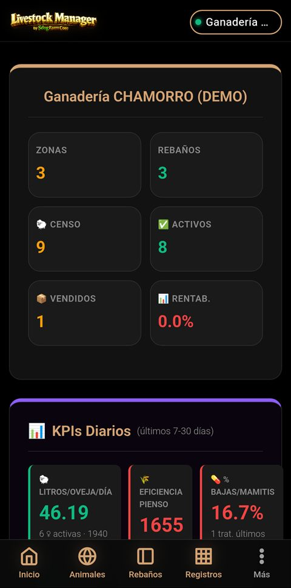
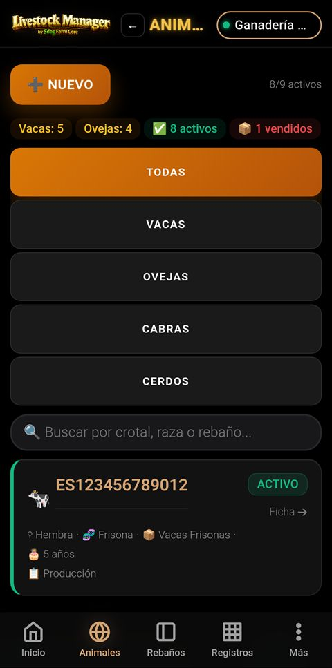
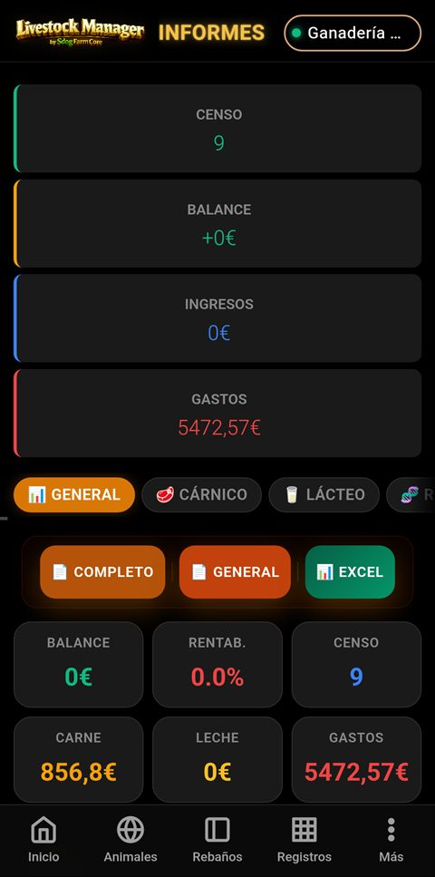
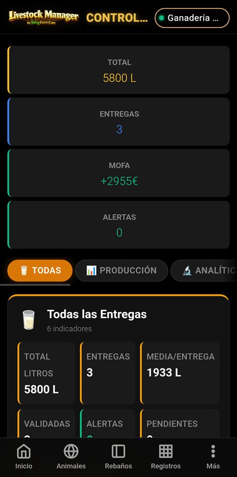
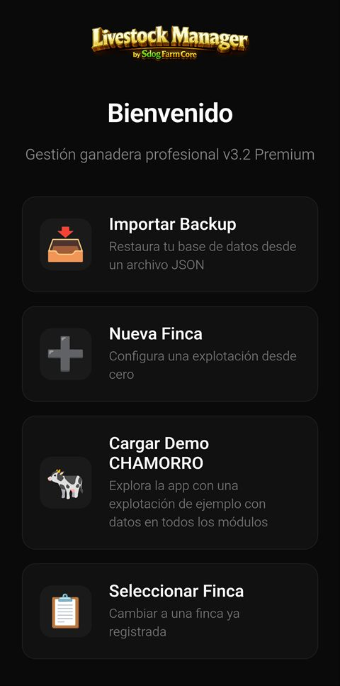
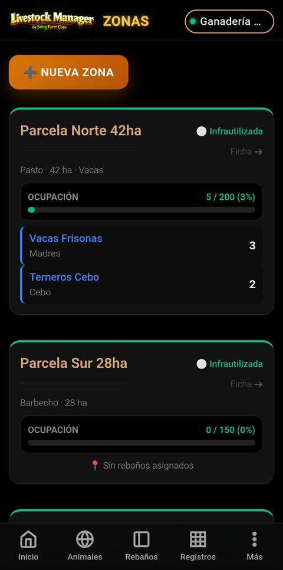
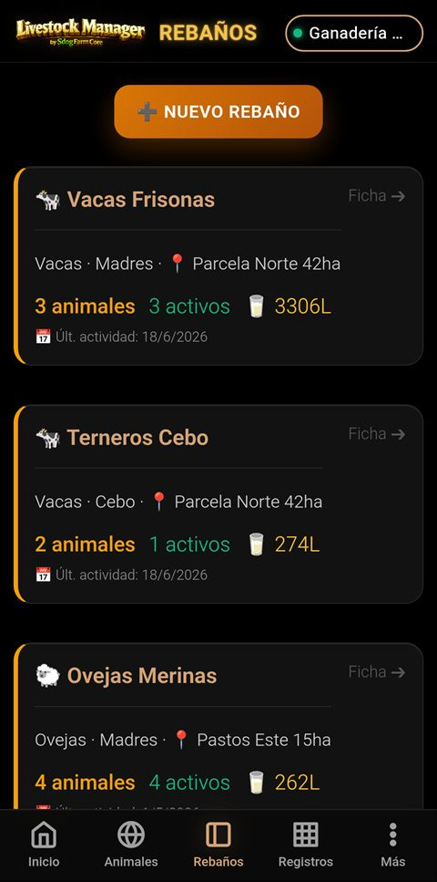
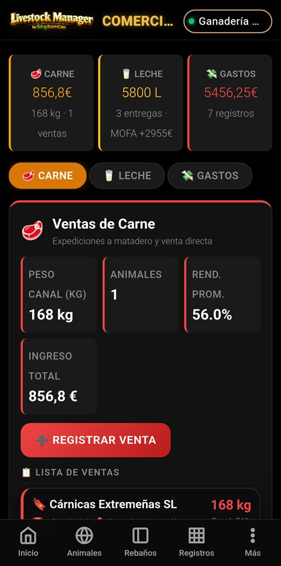
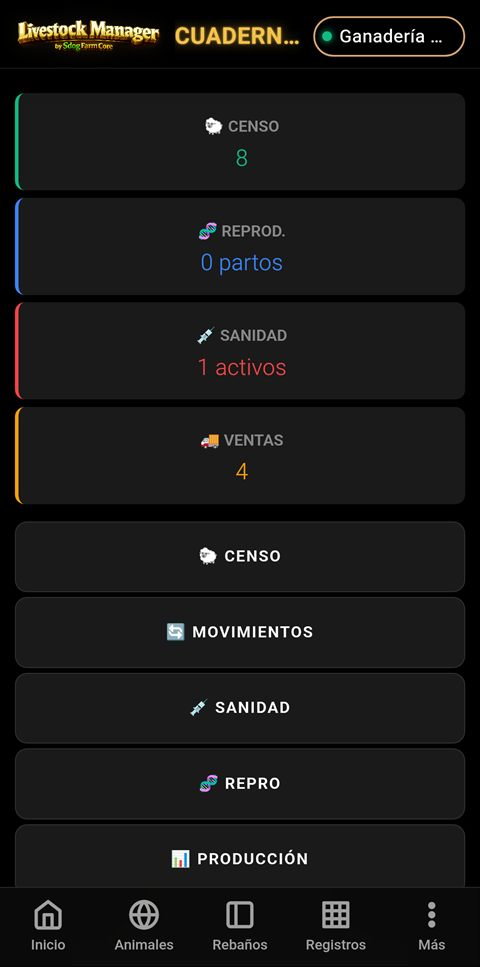
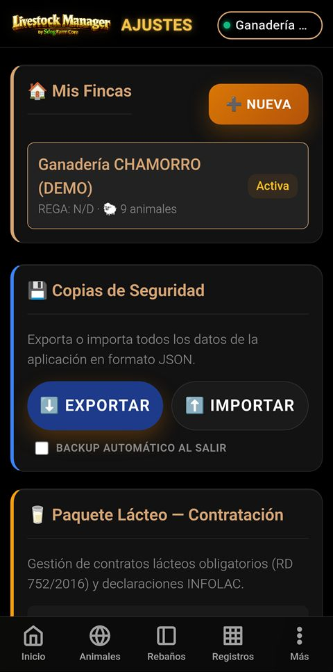

<div align="center">
  
  <br>
  <strong>v4.5.0</strong> · Sistema Profesional de Gestión Ganadera · Offline-First
</div>

---

# 🐄 Livestock Manager Premium

**Sistema profesional e independiente de gestión ganadera** diseñado para optimizar la trazabilidad industrial, el cumplimiento normativo (RD 787/2023), la contabilidad analítica y la comercialización en explotaciones de vacuno, ovino y caprino. Funciona 100% offline con sincronización nativa Android mediante **Capacitor**.

<div align="center">
  
  &nbsp;
  
  &nbsp;
  
  &nbsp;
  
  <br>
  <sub><em>Dashboard · Gestión de Animales · Centro de Informes · Control Lechero</em></sub>
</div>

---

## 📋 Tabla de Contenidos

- [✨ Demo y Onboarding](#-demo-y-onboarding)
- [📦 Módulos del Sistema](#-módulos-del-sistema)
- [📊 Centro de Informes (24 perspectivas)](#-centro-de-informes-24-perspectivas)
- [📓 Cuaderno Digital RD 787/2023](#-cuaderno-digital-rd-7872023)
- [📘 Manuales de Usuario](#-manuales-de-usuario)
- [⚙️ Ajustes y Configuración](#️-ajustes-y-configuración)
- [🚀 Características Técnicas](#-características-técnicas)
- [🏗️ Arquitectura](#️-arquitectura)
- [🔧 Mantenimiento y Build](#-mantenimiento-y-build)
- [📄 Licencia](#-licencia)

---

## ✨ Demo y Onboarding

El asistente de configuración inicial permite cargar la **Ganadería Demo "Chamorro"**, una explotación completa con:

| Recurso | Cantidad |
|---------|----------|
| 🏠 Finca | 1 (3 zonas/parcelas) |
| 🐑 Rebaños | 3 (Vacas Frisonas, Terneros Cebo, Ovejas Merinas) |
| 🐄 Animales | 9 (con genealogía, crotales, DIB) |
| ⚖️ Pesajes | 5 registros históricos |
| 🥛 Control Lechero Individual | 15 registros (3 vacas × 5 fechas) |
| 🥛 Control Lechero por Lote | 1 registro (1200L) |
| 🚛 Expedición de Tanque | 1 registro (1850L) |
| 💼 Ventas Carne | 2 ventas con DIMOE |
| 💰 Gastos | 3 categorías |
| 💊 Sanidad | 3 tratamientos con tiempos de espera |
| 🧬 Reproducción | 5 eventos |
| 🤝 Socios | 1 comprador, 1 proveedor, 1 transportista, 2 contratos |

<div align="center">
  
  &nbsp;&nbsp;
  
  &nbsp;&nbsp;
  
  <br>
  <sub><em>Onboarding · Zonas y Aforos · Rebaños</em></sub>
</div>

---

## 📦 Módulos del Sistema — ¿Para qué sirve cada uno?

### 📊 Dashboard (Pantalla de Inicio)
**¿Para qué sirve?** Es el centro de control de la explotación. Al abrir la app, el dashboard te muestra un resumen visual del estado actual de tu ganadería: cuántos animales tienes, cómo va el balance económico, si hay alertas sanitarias activas y los KPIS de producción diarios. Desde aquí puedes navegar rápidamente a cualquier sección.

**Qué puedes hacer:**
- Ver de un vistazo **animales activos vs totales**, **rentabilidad %**, **ingresos y gastos**
- Consultar **KPIs diarios**: Litros/Vaca/Día, eficiencia del pienso, % de bajas por mamitis — con semáforos 🟢🟡🔴
- Revisar **alertas sanitarias** (tratamientos con supresión activa), de trazabilidad (SIA) y administrativas (PAC, ADSG, INFOLAC)
- Ver **indicadores lácteos** de los últimos 12 meses: MOFA mensual, precio medio, extracto seco
- Acceder directamente a Animales, Rebaños, Producción o Informes

### 🐄 Gestión de Animales
**¿Para qué sirve?** Para registrar y consultar la ficha de cada animal de la explotación: su crotal oficial, especie, raza, sexo, fecha de nacimiento, rebaño al que pertenece, estado (activo/vendido/baja), chip RFID/NFC y su historial completo (pesajes, sanitarios, reproducción).

**Qué puedes hacer:**
- **Dar de alta** un animal nuevo con escáner de crotal (cámara) o lectura NFC
- **Buscar y filtrar** por especie (🐄🐑🐐), raza, crotal o nombre de rebaño
- Ver **edad**, **sexo** (♀♂) y **categoría productiva** de cada animal
- Acceder a la **genealogía** (madre del animal y sus crías)
- Registrar **movimientos** entre rebaños con validación de aforo
- Escanear el **crotal oficial** con la cámara del móvil

### 🐑 Rebaños
**¿Para qué sirve?** Para organizar los animales en lotes según su etapa productiva (Madres, Cebo, Recría, Reposición, Sementales). Cada rebaño tiene su propia ficha con censo, producción, historial sanitario y movimientos.

**Qué puedes hacer:**
- **Crear rebaños** nuevos con nombre, especie, tipo productivo y ubicación
- Ver de un vistazo cuántos **animales totales y activos** tiene cada rebaño
- Consultar la **producción** (kg de carne, litros de leche) registrada para ese rebaño
- Ver la **última actividad** registrada en el rebaño
- Acceder al **historial sanitario** completo (tratamientos, medicamentos, tiempos de supresión)
- **Mover animales** entre rebaños

### 📍 Zonas y Aforos
**¿Para qué sirve?** Para gestionar las parcelas, naves y recintos de la explotación. Controla la capacidad ganadera de cada zona (aforo máximo) y recibe alertas si se supera la ocupación permitida.

**Qué puedes hacer:**
- **Crear zonas** con nombre, aforo máximo, superficie (ha) y uso principal
- Ver el **estado de ocupación** de cada zona: 🔴 Sobrecarga / 🟡 Óptimo / 🟢 Aceptable / ⚪ Infrautilizada
- Consultar qué **rebaños y especies** están en cada zona
- Ver la **barra de ocupación global** de toda la explotación
- Recibir **alertas** si una zona supera su capacidad

### ⚖️ Producción Cárnica
**¿Para qué sirve?** Para registrar el peso de los animales (individual o por lotes) y hacer seguimiento del engorde. Calcula automáticamente la Ganancia Media Diaria (GMD) para detectar animales con bajo rendimiento.

**Qué puedes hacer:**
- **Pesar animales** de forma individual o por lotes completos
- Ver el **historial de pesadas** de cada animal
- Calcular la **GMD** (Ganancia Media Diaria) entre dos pesajes
- Obtener **proyecciones** de peso final y fecha óptima de venta

### 🥛 Control Lechero
**¿Para qué sirve?** Para gestionar la producción de leche: desde el control individual por vaca/oveja/cabra hasta la expedición del tanque. Incluye analíticas de laboratorio, cálculos de calidad y MOFA.

**Qué puedes hacer:**
- **Registrar producción** individual, por lote o expedición de tanque
- Ver **indicadores globales**: total litros, entregas, MOFA total, alertas
- Consultar **analíticas de calidad**: grasa, proteína, extracto seco, células somáticas — con semáforos 🟢🔴
- Calcular el **MOFA** (Margen sobre Coste de Alimentación)
- Gestionar **liquidaciones y precios** por entrega
- Acceder a la vista de **comercialización láctea** con contratos

### 🧬 Ciclo Reproductivo
**¿Para qué sirve?** Para hacer seguimiento del ciclo reproductivo del ganado: registrar celos, inseminaciones, diagnósticos de gestación, partos y abortos. Proporciona KPIs para evaluar la eficiencia reproductiva.

**Qué puedes hacer:**
- **Registrar eventos** reproductivos: celo, IA, ecografía, parto, aborto
- Consultar **KPIs**: tasa de fertilidad %, intervalo entre partos (IEP), índice de prolificidad
- Ver el **ratio de abortos** con semáforo 🟢🔴
- Analizar la **distribución trimestral** de partos
- Recibir **alarmas de parto** próximas

### 💰 Comercialización y Socios
**¿Para qué sirve?** Para gestionar las ventas de ganado y leche, mantener un directorio de compradores, proveedores y transportistas, y administrar contratos comerciales con precios, IVA y retenciones.

**Qué puedes hacer:**
- **Registrar ventas** de carne con wizard de 5 pasos (validación SIA, SEUROP, peso canal, DIMOE)
- **Registrar albaranes** de leche con wizard de 6 pasos (calidad, MOFA, precios)
- Gestionar **compradores**: datos fiscales, tipo (cárnico/lácteo/híbrido), contratos, historial
- Gestionar **proveedores**: datos fiscales, categorías de gasto, historial de facturas
- Gestionar **transportistas**: matrícula, tipo vehículo, capacidad, certificados bienestar
- Administrar **contratos**: precios pactados, IVA, retenciones, fechas de vigencia

<div align="center">
  
  <br>
  <sub><em>Módulo de comercialización: ventas de carne y leche con trazabilidad</em></sub>
</div>

### 💸 Gastos Analíticos
**¿Para qué sirve?** Para llevar un control detallado de todos los gastos de la explotación, categorizados por tipo (alimentación, sanidad, electricidad, personal, fitosanitarios, amortización). Los gastos pueden asignarse a un rebaño o zona específica.

**Qué puedes hacer:**
- **Registrar gastos** con categoría, concepto, monto, fecha y proveedor
- Ver la **evolución mensual** de los últimos 6 meses con gráfico de barras
- Filtrar por **categoría contable** (7 categorías con tabs)
- Consultar el **total acumulado** por categoría y período

### 🔄 Trazabilidad 360°
**¿Para qué sirve?** Para consultar la línea de vida completa de un animal desde que nace (o se da de alta) hasta su venta o baja. Todos los eventos se muestran en un timeline cronológico accesible desde la ficha del animal.

**Qué puedes hacer:**
- Ver el **timeline completo**: nacimiento, tratamientos sanitarios, eventos reproductivos, pesajes, movimientos y venta
- Consultar **KPIs rápidos**: nº de pesajes, tratamientos, eventos reproductivos y movimientos
- **Exportar a PDF** con overlay de progreso, barra animada y botón flotante para compartir en Android
- Acceder desde la **ficha del animal** mediante el botón 🔄 360°

### 📸 Escáner de Crotales Integrado
**¿Para qué sirve?** Para leer el código de barras o QR del crotal oficial del animal usando la cámara del dispositivo, evitando errores de escritura manual.

**Qué puedes hacer:**
- Escanear **códigos de barras** (EAN-13, EAN-8, CODE-128, CODE-39) y **códigos QR**
- Usar el **escáner nativo** en Android (plugin Capacitor) con vista de cámara a pantalla completa
- Usar el **escáner web** (html5-qrcode) para navegadores y PWA con cámara en vivo y recuadro guía
- El código se asigna automáticamente al campo **Nº CROTAL**, se convierte a mayúsculas y se valida el formato

---

## 📊 Centro de Informes (24 perspectivas)

Potente motor analítico con **24 tabs** y exportación PDF/Excel con barra de progreso y botón flotante para compartir:

### Informes Base (14)

| Tab | Datos | Gráficos |
|-----|-------|----------|
| 📊 **General** | Balance, rentabilidad %, censo, ingresos, gastos, **comparativa mensual** | Scatter margen, timeline leche |
| 🥩 **Cárnico** | Ingresos, kg, precio medio kg, **GMD global**, rentabilidad por zona/rebaño | Scatter, barras zonas |
| 🥛 **Lácteo** | Litros, MOFA, **calidad (grasa, proteína, ES, somáticas)** con semáforos, producción por rebaño | Timeline leche |
| 🧬 **Reproductivo** | Fertilidad, IEP, prolificidad, **ratio abortos**, **distribución partos** | Doughnut fertilidad |
| ⚕️ **Sanidad** | Tratamientos, supresión activa, **coste sanitario/animal**, tratamientos por rebaño | Pie categorías |
| 🐑 **Censo** | Total/activos/vendidos, por especie, **por categoría productiva**, detalle rebaño | — |
| 📒 **Ventas** | Libro ventas con albarán, IVA, retención, DIMOE, **precio medio por comprador** | — |
| 🏢 **Compradores** | Ranking, ingresos, kg, ventas por comprador | Barras ingresos |
| 📦 **Proveedores** | Ranking, gasto total, facturas, categorías | Doughnut categorías |
| 🧪 **Fitosanitario** | Gasto total, operaciones, zonas tratadas | — |
| 🚨 **Alertas** | Sanitarias, trazabilidad, administrativas, calendario preventivo | — |
| 🏠 **Por Finca** | Ficha explotación, censo, rebaños, resumen económico | — |
| 📋 **REGA** | Datos REGA, censo por especie, **KPIs superiores**, movimientos recientes | — |
| 📤 **Exportar** | Exportación oficial REGA, SIA/PIGGAN | — |

### Informes Económicos y Analíticos (10 nuevos)

| Tab | Datos | Función Analytics |
|-----|-------|-------------------|
| 💰 **PyG** | Cuenta Resultados mensual, gastos por categoría con % | `obtenerCuentaResultados()` |
| 🐄 **Coste/Animal** | €/cabeza, €/día, % alimentación, % sanidad por rebaño | `obtenerCosteProduccionDiario()` |
| 📊 **Eficiencia Técnica** | KPIs con semáforos 🟢🟡🔴 vs objetivos configurables | `obtenerEficienciaTecnica()` |
| 📐 **Aforos** | Carga por zona, % ocupación, alertas sobrecarga/infrautilización | `obtenerCargasAforos()` |
| 🔄 **Rotación** | Entradas/salidas 90d, nacimientos, compras, ventas, bajas, tasa reposición | `obtenerRotacionCenso()` |
| 📈 **Flujo Caja** | Flujo mensual entradas/salidas/neto/acumulado | `obtenerFlujoCaja()` |
| 🧬 **Rent. Especie** | Ingresos/gastos/balance por especie con nº animales y ventas | `obtenerRentabilidadEspecie()` |
| 📉 **Curva Prod.** | Producción acumulada vs meta mensual, % cumplimiento | `obtenerCurvaProduccion()` |
| ⚖️ **Break-Even** | Punto muerto carne/leche, costes fijos/variables, margen seguridad | `obtenerBreakEven()` |
| 🌾 **PAC** | Gestor de subvenciones con alta desde overlay | `_obtenerDatosPAC()` |

### Barra KPIs Globales
Siempre visible sobre los tabs: **Censo · Balance · Ingresos · Gastos**

---

## 📓 Cuaderno Digital RD 787/2023

Informe oficial para inspecciones con 8 secciones y **navegación rápida**:

| # | Sección | Contenido |
|---|---------|-----------|
| 1 | 🏠 Explotación | Datos REGA, CEA, ADSG, veterinario |
| 2 | 🐑 Censo | Por especie, sexo, categoría productiva |
| 3 | 🔄 Movimientos | Eventos registro, altas, bajas, movimientos |
| 4 | 💉 Sanidad | Tratamientos activos, tiempos de espera |
| 5 | 🧬 Reproductivo | Partos, cubriciones, gestaciones |
| 6 | 📦 Producción | Ventas carne y leche, pesajes |
| 7 | 💰 Económico | Balance estimado |
| 8 | 🚛 Transportistas | Registro de transportistas |

KPIs superiores: **Censo · Partos · Tratamientos · Ventas**

<div align="center">
  
  &nbsp;&nbsp;
  
  <br>
  <sub><em>Cuaderno Digital RD 787/2023 · Ajustes y configuración</em></sub>
</div>

---

## 📘 Manuales de Usuario

8 manuales interactivos accesibles desde **Ajustes → Manuales** con exportación a PDF:

| Manual | Secciones |
|--------|-----------|
| 📖 **Manual General** | 17 secciones, guía completa |
| 🐑🥩 **Ovino de Carne** | Ejemplo práctico raza Merina |
| 🐑🧀 **Ovino de Leche** | Ejemplo práctico raza Manchega |
| 📊 **Registros Producción** | Pesajes, GMD, control lechero, MOFA |
| 💰 **Comercialización** | Venta Masiva 5 pasos + Albarán Leche 6 pasos |
| ⚖️ **Pesadas** | Individual y por lote |
| 🥛 **Control Lechero** | Individual, lote, expedición tanque |
| 💰 **Gastos** | Costes analíticos por categoría |

---

## ⚙️ Ajustes y Configuración

### Secciones disponibles

| Sección | Descripción |
|---------|-------------|
| 🏠 **Mis Fincas** | Gestión multi-finca con conteo de animales |
| 💾 **Copias Seguridad** | Export/import JSON + backup automático |
| 🥛 **Paquete Lácteo** | Contratos lácteos RD 752/2016, INFOLAC |
| ⚕️ **ADSG** | Sanidad ganadera, veterinario, vencimientos |
| 🌍 **Config. Autonómica** | SIGGAN / BADIGEX, plataforma movimiento |
| 🎯 **Objetivos Explotación** | GMD, L/vaca/día, fertilidad, ocupación, rentabilidad, % bajas |
| 🧬 **Especies y Razas** | CRUD especies con consumo agua y precio referencia |
| 🔔 **Gestión Alertas** | Activar/desactivar alertas: Sanitarias, Trazabilidad, PAC, ADSG, INFOLAC, Contratos |
| 🌙 **Preferencias** | Modo oscuro, formato fecha (ES/EN), moneda (€/$) |
| 🗂️ **Info. Sistema** | Versión BD, Service Worker, limpiar caché |
| 🏷️ **Trazabilidad** | Pedido de crotales |
| ⚕️ **Guía Farmacológica** | Tiempos de retiro y dosificación |

---

## 🚀 Características Técnicas

### 🔐 Funcionamiento Offline 100%
Toda la lógica opera en el dispositivo mediante **IndexedDB v9**. Sin necesidad de conexión a internet para registrar animales, pesajes, ventas o generar informes.

### 📸 Escáner de Crotales & NFC
Identificación rápida mediante cámara (códigos de barras/QR) y lectura de etiquetas NFC/RFID.

### 📄 Exportación PDF con Barra de Progreso
Sistema de renderizado de alta fidelidad con ajuste dinámico a formato A4, barra de progreso animada y botón flotante para **compartir** por Capacitor / Web Share API.

### 📊 Exportación Excel Multi-Hoja
Generación de libros Excel con pestañas independientes por módulo (Animales, Ventas Carne, Leche, Gastos, Sanitarios, Censo, Compradores, Proveedores).

### 🌍 Adaptación Autonómica
- **Andalucía:** Guías sanitarias automáticas 365d, plataforma PIMA, subvención ADSG directa
- **Extremadura:** Guías requieren confirmación, plataforma Arado/Laboreo, control ADSG estricto

### 💾 Cifrado AES-GCM
Datos sensibles de producción cifrados con AES-GCM (Web Crypto API) con fallback a localStorage cuando Capacitor Filesystem no está disponible.

### 🛡️ Service Worker
Cache-first strategy con nombre `corcho-v6.5.9` para carga instantánea en visitas repetidas.

---

## 🏗️ Arquitectura

```
C:/livestock-manager/
├── index.html                 # SPA entry point
├── capacitor.config.ts        # Config Capacitor (appId, webDir)
├── manifest.webmanifest       # PWA manifest
├── sw.js                      # Service Worker (cache-first)
├── package.json               # Scripts: build, cap:sync, cap:open
├── js/
│   ├── analitica.js           # Motor analítico (15+ funciones)
│   ├── app.js                 # Router y controlador principal
│   ├── animales.js            # Modelo de datos animal
│   ├── crypto.js              # Cifrado AES-GCM con fallback
│   ├── db.js                  # IndexedDB v9 (7 stores, 30+ índices)
│   ├── fincas.js              # Gestión multi-finca
│   ├── produccion.js          # Producción carne/leche/ventas
│   ├── pesajes.js             # Registro maestro de eventos
│   ├── trazabilidad.js        # Motor SIA + documentos oficiales
│   ├── seed-data.js           # Finca Demo Chamorro
│   ├── wizard-manager.js      # Framework de wizards multi-paso
│   ├── snapshot-service.js    # Contexto histórico inalterable
│   ├── services/              # 7 servicios (Alertas, Balance, PDF, etc.)
│   ├── views/                 # 20 vistas modulares
│   │   ├── wizards/           # 7 asistentes interactivos
│   │   └── helpers/           # Calidad leche, ayuda farmacológica
│   └── ... (15+ módulos más)
├── css/
│   ├── styles.css             # Estilos globales
│   └── design-system/         # Sistema de diseño
├── manual/                    # 8 manuales HTML + 8 PDFs
├── docs/                      # Documentación, capturas, guías
├── icons/                     # Assets visuales
└── www/                       # Build output (Capacitor)
```

### Stack Tecnológico

| Componente | Tecnología |
|------------|------------|
| Frontend | Vanilla JS, HTML5, CSS3 |
| Mobile | Capacitor 5 (Android) |
| Persistencia | IndexedDB v9 (idb wrapper) |
| Cifrado | Web Crypto API (AES-GCM) |
| PDF | html2pdf.js 0.10.1 |
| Excel | SheetJS (xlsx) 0.18.5 |
| Gráficos | Chart.js |
| Escáner | @capacitor-community/barcode-scanner |
| NFC/RFID | @capacitor/filesystem |
| AI/Agent | @earendil-works/pi-agent-core |

---

## 🔧 Mantenimiento y Build

```bash
# Build web (raíz → www)
npm run build

# Añadir plataforma Android (primera vez)
npm run cap:add

# Sync completo a Android
npm run cap:sync

# Abrir Android Studio
npm run cap:open
```

### Flujo de desarrollo
1. Los archivos fuente están en la **raíz** (`js/`, `css/`, etc.)
2. `npm run build` copia de raíz → `www/`
3. `npx cap sync android` copia de `www/` → `android/app/src/main/assets/public/`
4. Android Studio compila desde `android/app/`

---

## 📄 Licencia

© 2026 Livestock Manager Premium · v4.5.0. Todos los derechos reservados.

**Desarrollado por David Asuar Arteaga**

- 📧 [soporte.sdogfarm@gmail.com](mailto:soporte.sdogfarm@gmail.com)
- 🐙 [github.com/SADOCKDOG/LIVESTOCK-MANAGER](https://github.com/SADOCKDOG/LIVESTOCK-MANAGER)

*Licencia: Uso privado — Prohibida la redistribución sin autorización expresa del desarrollador.*
