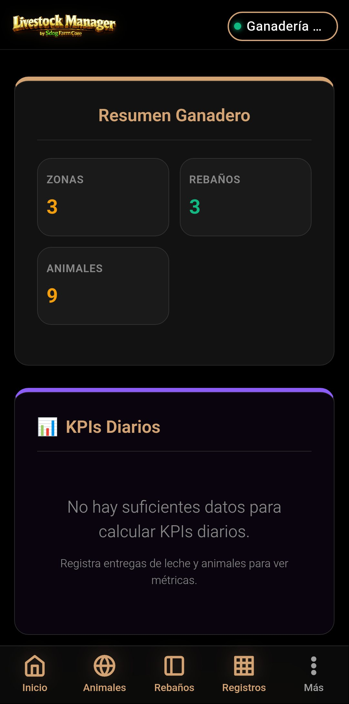
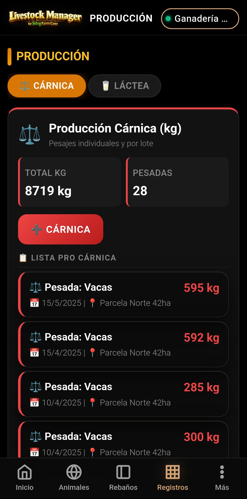
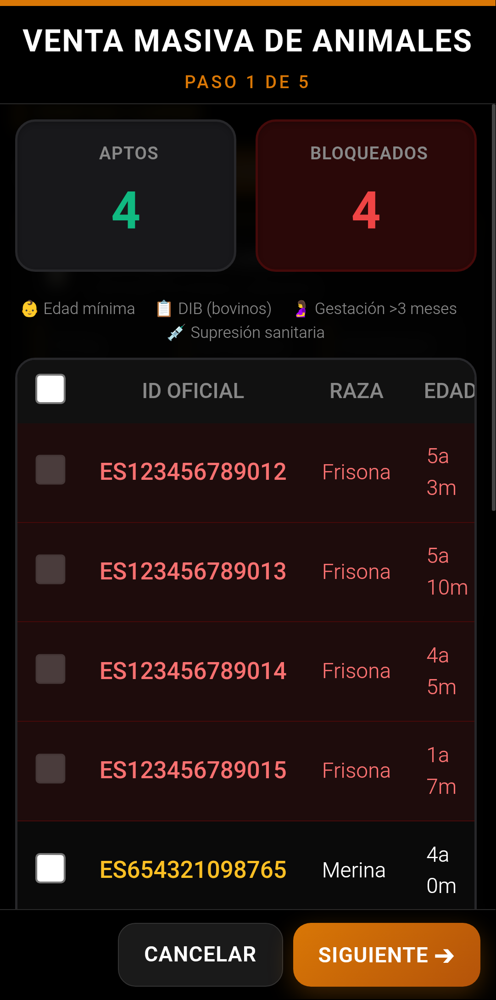
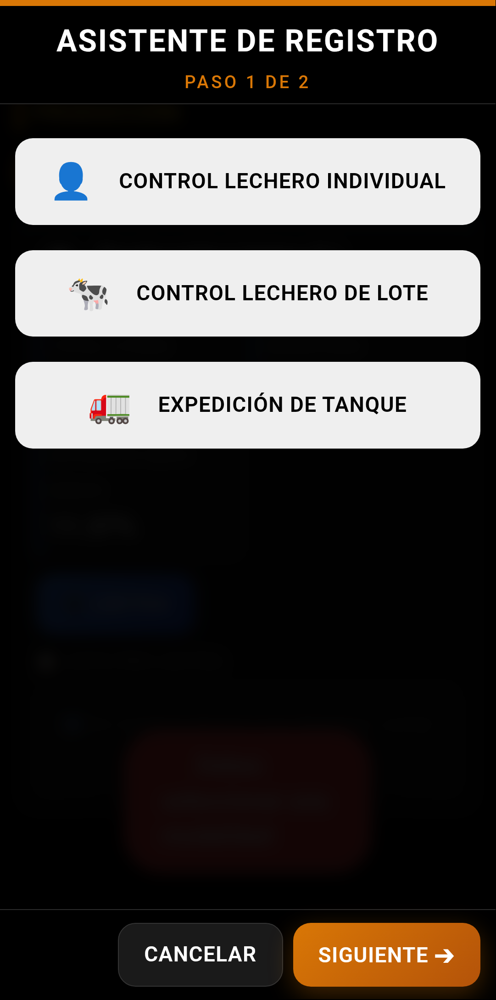

<div align="center">
  
</div>

# Livestock Manager Premium

Sistema profesional e independiente de gestión ganadera diseñado para optimizar la trazabilidad, el cumplimiento normativo de seguridad alimentaria y la contabilidad analítica en explotaciones industriales. Optimizado para dispositivos Android mediante **Capacitor**.

---

## ✨ Onboarding y Finca Demo "Chamorro"

Livestock Manager incluye un sistema de despliegue rápido para evaluación y formación. Desde el asistente de configuración inicial, el usuario puede cargar la **"Ganadería Chamorro"**:

*   **Población Instantánea:** Genera automáticamente un ecosistema ganadero completo con censo, rebaños, zonas, pesajes históricos y registros contables.
*   **Prueba de Concepto:** Permite visualizar el 100% de los informes, alertas del motor SIA, analíticas lácteas y cuadros de mando sin necesidad de introducir datos manualmente.
*   **Curva de Aprendizaje:** Diseñada para que el usuario explore flujos complejos (como el cálculo de MOFA o ventas masivas) con datos realistas antes de configurar su propia explotación.

---

## 📦 Módulos Detallados del Sistema

Livestock Manager integra una suite completa de herramientas diseñadas para el control total de la explotación:

<div align="center">
  
  
  
  
</div>

### 📊 Dashboard Inteligente & SIA
El centro de control de la aplicación ofrece una visión de 360° de la finca.
*   **KPIs de Rendimiento:** Cálculo dinámico de Litros/Oveja/Día, Eficiencia de Pienso y Tasa de Morbilidad.
*   **SIA (Sistema de Inteligencia Animal):** Motor de reglas que monitoriza en tiempo real periodos de supresión de medicamentos, duplicidad de crotales y validaciones de edad mínima.
*   **Balance Económico:** Visualización inmediata del flujo de caja del mes actual.

### 🐄 Gestión de Censo y Genealogía
Base de datos técnica individualizada y linaje.
*   **Ficha Individual:** Historial de vida completo (nacimiento, movimientos, pesajes, sanidad y descendencia).
*   **Genealogía:** Sistema de linaje que vincula automáticamente a las crías con sus madres (trazabilidad ascendente/descendente).
*   **Identificación Avanzada:** Soporte para crotal oficial, DIB (Pasaportes) y búsqueda inteligente.

### 🐑 Rebaños y Organización Operativa
Flexibilidad total para organizar el ganado según su etapa productiva.
*   **Tipologías:** Clasificación por lotes de Madres, Cebo, Recría o Reposición.
*   **Movimientos:** Registro histórico de cambios de rebaño y ubicación para el Cuaderno Digital.

### 📍 Zonas, Recintos y Aforos
Control físico de la explotación para el cumplimiento de bienestar animal.
*   **Gestión Espacial:** Definición de parcelas, naves y lazaretos.
*   **Validación de Aforo:** Alerta inmediata si la carga ganadera supera la capacidad máxima de la zona.

### ⚖️ Producción Cárnica y Crecimiento
Seguimiento industrial del engorde.
*   **Wizards de Pesaje:** Interfaz optimizada para pesaje individual o masivo por lotes.
*   **Cálculo de GMD:** Análisis automático de la Ganancia Media Diaria para detectar anomalías de crecimiento.

### 🥛 Control Lechero y Calidad (Letra Q)
Gestión avanzada para explotaciones lácteas.
*   **Analíticas de Laboratorio:** Seguimiento de Grasa, Proteína, Células Somáticas y UFC.
*   **Cálculo de MOFA:** Margen Sobre el Coste de Alimentación por litro producido.

### 🐣 Ciclo Reproductivo Completo
Monitorización del potencial genético y productivo futuro.
*   **Eventos:** Registro de Celos, Inseminaciones (IA), Diagnósticos de Gestación y Partos.
*   **Alarmas de Parto:** Notificaciones de fechas probables para preparación de parideras.

### 💰 Comercialización y Socios
Módulo comercial para la gestión de salidas y facturación.
*   **Wizard de Venta Masiva:** Proceso guiado en 5 pasos con validación SIA y clasificación SEUROP.
*   **Gestión de Socios:** Directorio de Compradores, Transportistas y Proveedores con contratos vinculados.

### 📋 Gastos Analíticos y Contabilidad
Control exhaustivo de los costes de explotación.
*   **Categorización:** Alimentación, Sanidad, Electricidad, Personal, Fitosanitarios.
*   **Imputación Cruzada:** Asignación de costes a finca, rebaño o zona física.

### 📈 Centro de Informes Premium
Potente motor analítico con 14 perspectivas diferentes.
*   **Perspectivas:** REGA, Censo, Ventas, Sanidad, Fitosanitario, por Socio, etc.
*   **Exportación:** PDFs profesionales con progreso y Excel multioja.

### 📓 Cuaderno Digital y Documentos Legales
Cumplimiento normativo automatizado (**RD 787/2023**).
*   **Repositorio Documental:** Gestión de DIMOE, Facturas, Certificados y DIB.
*   **Renderizado PDF:** Lógica A4 optimizada para impresión profesional.

### 📚 Centro de Ayuda y Manuales
Formación integrada y herramientas de consulta.
*   **Manuales:** 8 guías paso a paso exportables a PDF con barra de progreso.
*   **Guía Farmacológica:** Base de datos de retiros y calculadora de dosificación.

---

## 🚀 Características Destacadas

### 📄 Exportación PDF de Alta Calidad
Sistema con barra de progreso y ajuste dinámico a formato A4, garantizando documentos profesionales sin cortes de texto.

### 🛡️ Trazabilidad 360° Offline
Funcionamiento 100% local-first mediante IndexedDB para registro en zonas sin cobertura.

### 🌍 Adaptación Autonómica
Configuración para normativas de Andalucía (**SIGGAN**) y Extremadura (**BADIGEX**) con umbrales PAC automáticos.

---

## 🏗️ Arquitectura Técnica

```
www/
├── js/
│   ├── services/       # Lógica (Comunidades, Alertas, Balance, Crypto)
│   ├── views/          # Vistas (Dashboard, Animales, Informes)
│   ├── wizards/        # Asistentes (Venta, Leche, Gasto)
│   ├── app.js          # Controlador (Router y eventos)
│   ├── db.js           # IndexedDB v9 (Persistencia)
│   └── trazabilidad.js # Reglas y documentos PDF
├── manual/             # Manuales en HTML
├── docs/               # Documentación y capturas
└── icons/              # Logotipos
```

---

## 📄 Licencia y Soporte

© 2026 Livestock Manager Premium · v4.5.0. Todos los derechos reservados.

**Desarrollado por David Asuar Arteaga**

- **Repositorio:** [github.com/SADOCKDOG/LIVESTOCK-MANAGER](https://github.com/SADOCKDOG/LIVESTOCK-MANAGER)
- **Email:** [soporte.sdogfarm@gmail.com](mailto:soporte.sdogfarm@gmail.com)

*Licencia: Uso privado — Prohibida la redistribución sin autorización expresa del desarrollador.*
