<p align="center">
  
</p>

<h1 align="center">Livestock Manager Premium</h1>

<p align="center">
  Plataforma profesional de gestión ganadera diseñada para optimizar la operativa de campo, garantizar el cumplimiento normativo oficial y agilizar la toma de decisiones financieras y comerciales. Adaptada estrictamente a la normativa legal española (RD 787/2023) y a los marcos autonómicos SIGGAN (Andalucía) y BADIGEX (Extremadura).
</p>

---

## 1. Galería de la Aplicación (Tema "Industrial Premium")

A continuación se presenta la secuencia completa de capturas de la interfaz de usuario de **Livestock Manager v5.0.0**, diseñada bajo la estética **Industrial Premium** (Modo Oscuro optimizado para OLED, alto contraste neón para operabilidad bajo luz solar directa en campo):

### 1.1 Vistas y Módulos Principales
| 0. Panel de Inicio | 1. Módulo Ganadero | 2. Explotación (ExPro) |
| :---: | :---: | :---: |
| 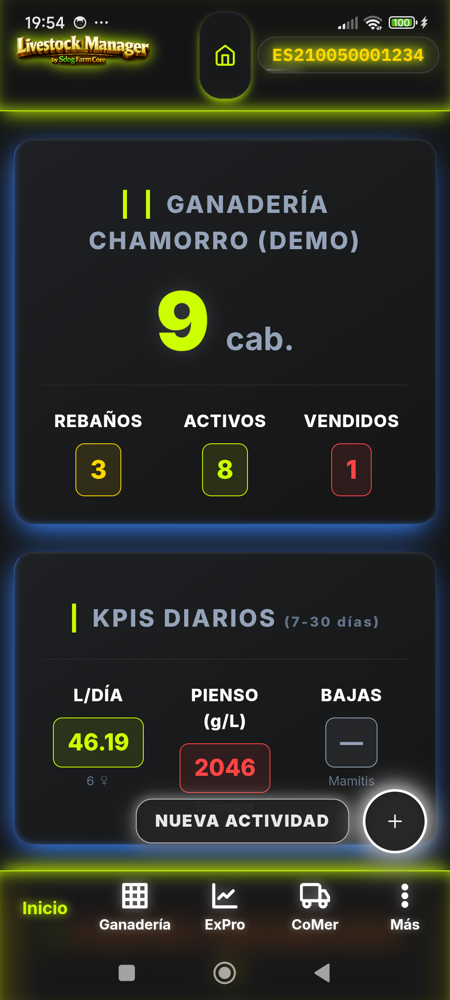 | 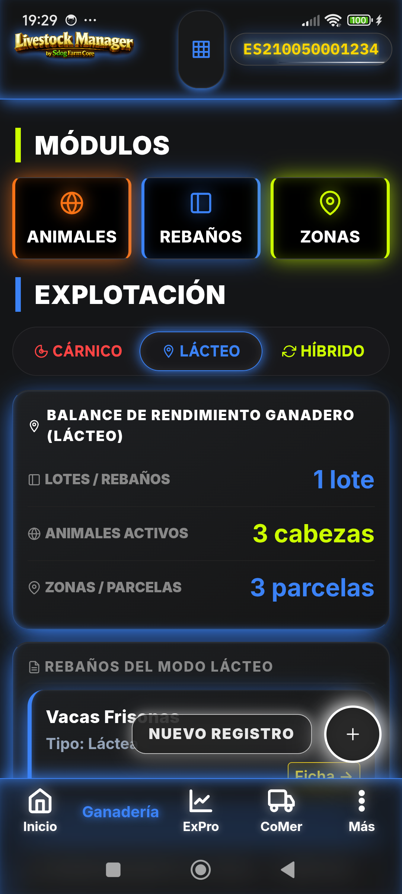 | 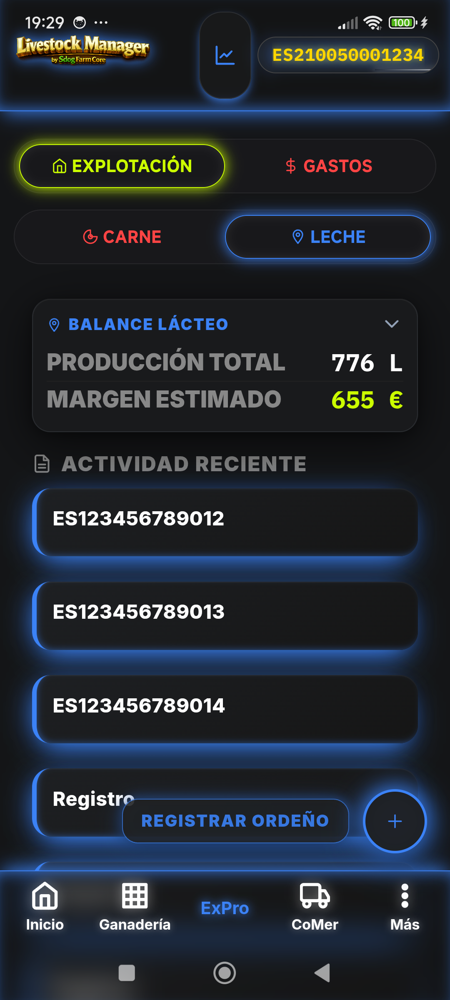 |

| 3. Comercial (CoMer) | 4. Menú Extendido (MÁS) | 5. Control de Zonas y Pastos |
| :---: | :---: | :---: |
| 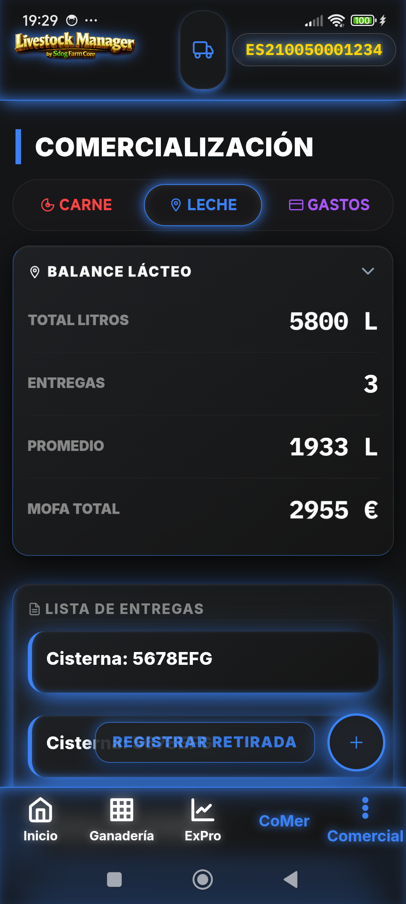 | 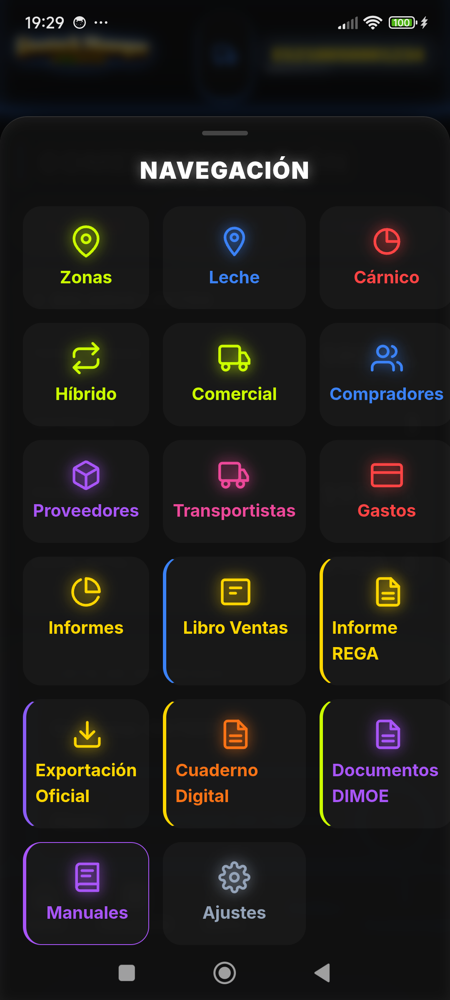 | 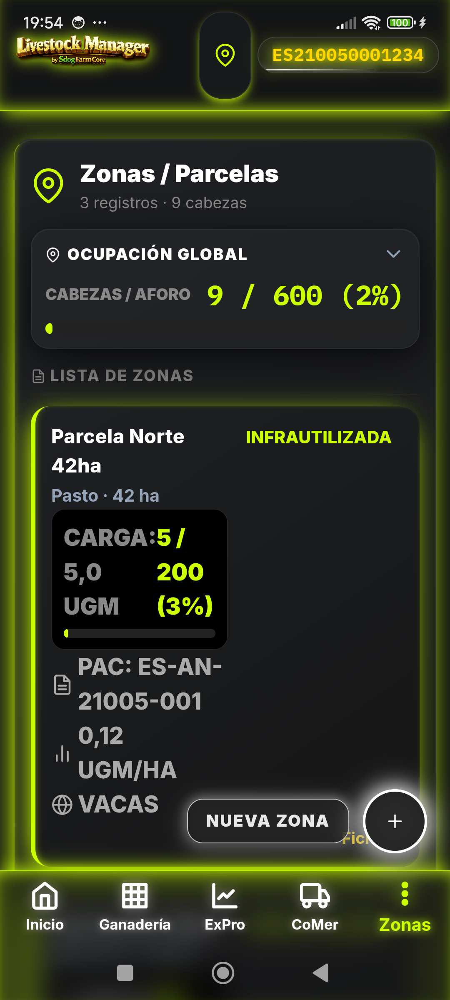 |

### 1.2 Líneas de Producción, Comercialización y Logística
| 6. Control Lechero | 7. Control Cárnico y Cebadero | 8. Contratos de Compraventa |
| :---: | :---: | :---: |
| 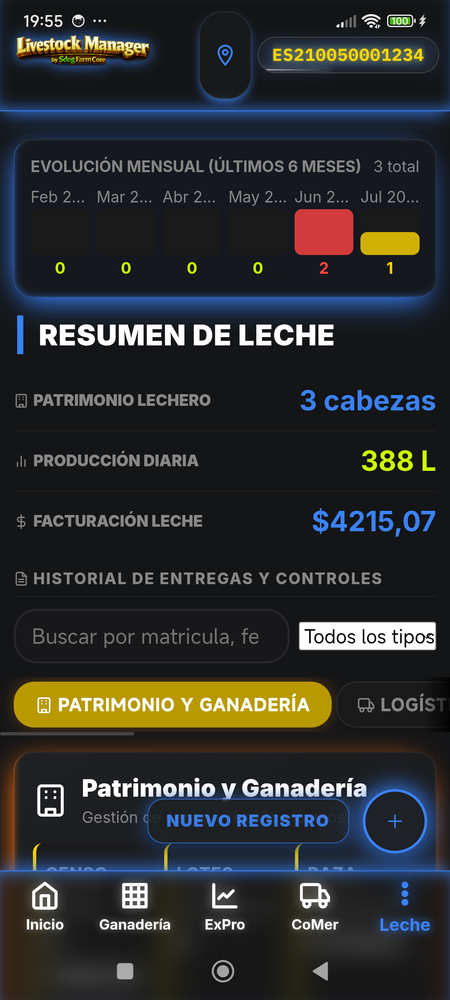 | 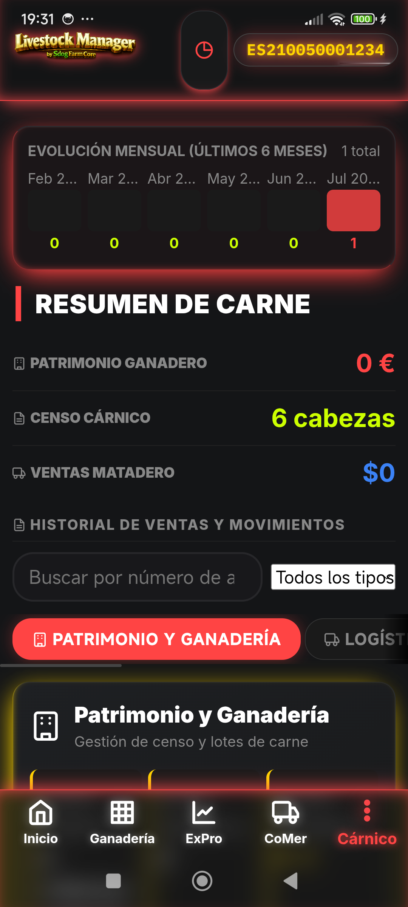 | 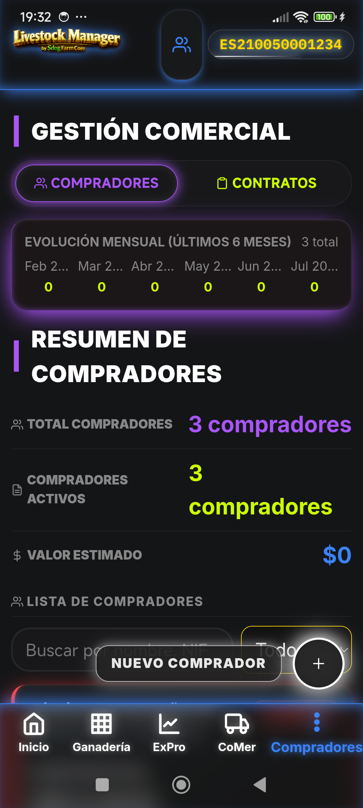 |

| 9. Directorio de Compradores | 10. Gestión de Transportistas | 11. Módulo de Gastos Operativos |
| :---: | :---: | :---: |
|  | 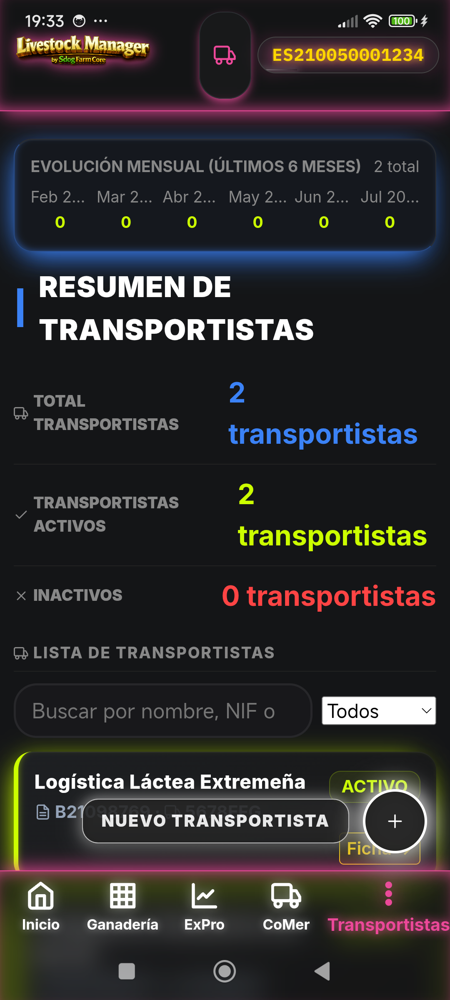 | 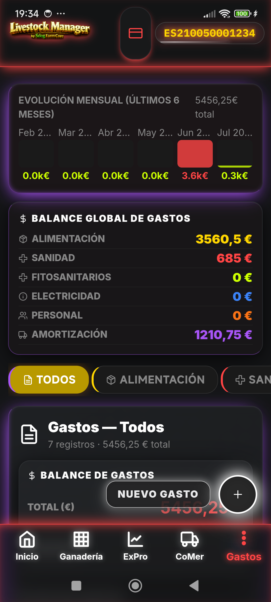 |

### 1.3 Cuaderno de Campo, Documentación Oficial y Ajustes
| 14. Cuaderno Digital (CUE) | 15. Documentación DIM_OE | 13. Declaraciones Oficiales |
| :---: | :---: | :---: |
| 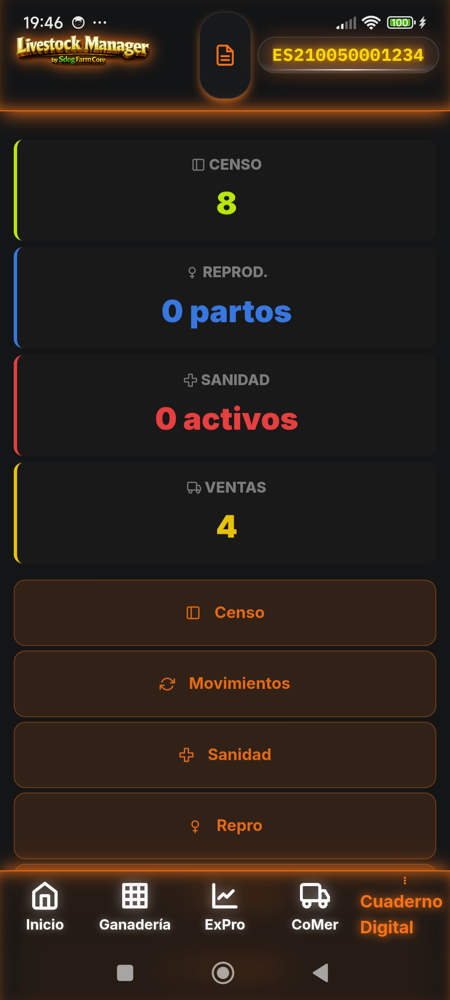 | 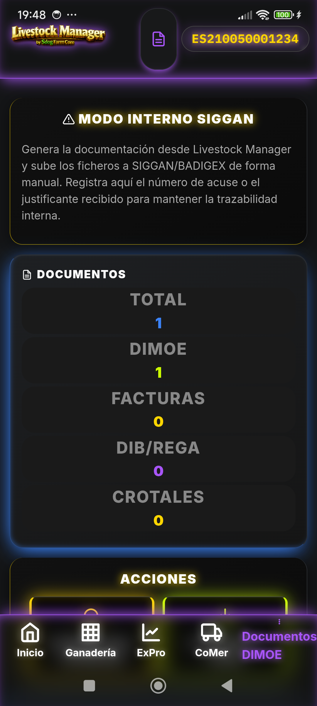 |  |

| 12. Exportación de Datos | 16. Panel de Ajustes / RFID | |
| :---: | :---: | :---: |
| 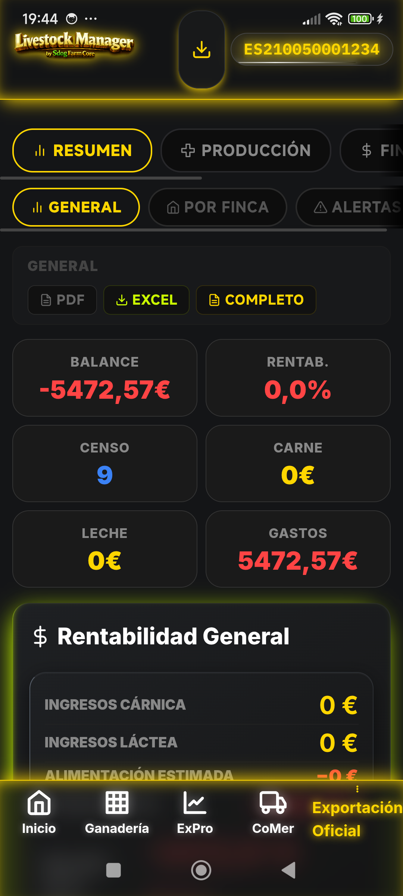 | 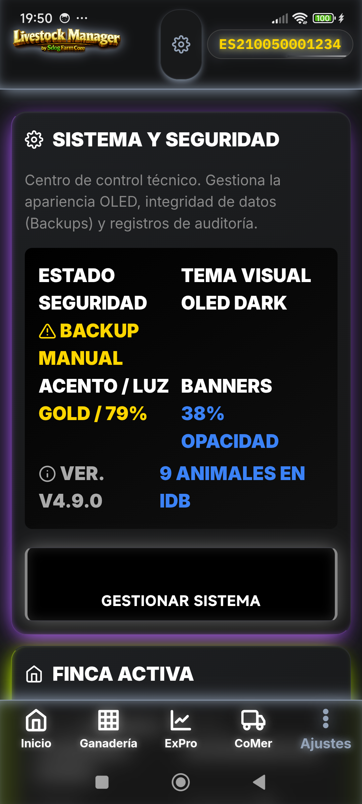 | *(Secuencia de 17 pantallas)* |

---

## 2. Alcance Funcional y Módulos de la App

La aplicación cuenta con una cobertura integral de los siguientes módulos:

* **Gestión de Explotaciones (Fincas):** Configuración del código REGA, código CEA, datos fiscales del titular, dirección y asignación territorial de fincas.
* **Módulo Ganadero:** Censo completo de animales activos, rebaños lógicos y zonas físicas de pastoreo/fincas.
* **Registros de Producción:** Control e imputación de pesajes individuales o por lotes (carne) y entregas diarias de leche al tanque de refrigeración.
* **Comercialización:** Gestión de ventas de carne, albaranes de leche con detalle de calidades (grasa, proteína, células somáticas, bacteriología) y liquidaciones comerciales.
* **Gestión de Entidades Terceras:** Catálogo centralizado de Compradores (clientes), Proveedores (trazabilidad de costes) y Transportistas.
* **Contratos:** Registro de acuerdos comerciales de suministro lácteo y cárnico vinculados a la explotación.
* **Sanidad Ganadera:** Registro detallado de tratamientos veterinarios aplicados, dosificación, periodo de supresión para carne/leche y alertas preventivas de comercialización.
* **Control Reproductivo:** Ciclo de reproducción completo (registro de celo, inseminación artificial, diagnóstico de gestación y parto), genealogía y trazabilidad madre-cría.
* **Gastos:** Asistente de imputación de costes (alimentación, electricidad, personal, amortizaciones, etc.) para cálculo del margen neto de explotación.
* **Informes Premium (BI):** Panel de Inteligencia Analítica con balance de Pérdidas y Ganancias (P&G), flujo de caja, punto de equilibrio (Break-even), subvenciones de la PAC e informes de aforo de carga.
* **Gestión Documental:** Archivo oficial digital para almacenar guías de movimiento DIMOE, declaraciones ICA (Información de la Cadena Alimentaria) y actas de saneamiento.

> Para detalles sobre el sistema de diseño y componentes aprobados, consulte la [Librería de Componentes](docs/COMPONENT-LIBRARY.md) y la [Plantilla de Card de Registro](docs/PLANTILLA-CARD-REGISTRO.md).

---

## 3. Adaptación al Marco Normativo SIGGAN / BADIGEX

Para cumplir con las directrices oficiales de trazabilidad y auditoría de la Junta de Andalucía (SIGGAN) y del Gobierno de Extremadura (BADIGEX), el sistema implementa las siguientes adaptaciones a nivel de base de datos y flujos lógicos:

### 3.1 Trazabilidad y No Borrado Destructivo
* Queda estrictamente prohibido el borrado físico (`DELETE`) de entidades con repercusión en la cadena alimentaria (animales, tratamientos, ventas).
* En su lugar, se ejecuta un marcado de anulación lógica y trazable (`estado: 'anulado'`), preservando el registro histórico para auditoría.
* Cada acción operativa de anulación, alta o cambio es registrada en la tabla de auditoría `registro_eventos`.

### 3.2 Ciclo de Estados Administrativos de Trámites
* Los procesos que requieren comunicación oficial (como las guías DIMOE o altas de censo) incorporan un ciclo de estados oficializado:
  ```text
  Borrador ──➔ Presentado ──➔ Aceptado / Rechazado (con número de registro oficial)
  ```
* Se guardan metadatos como fecha de presentación, número de registro oficial y archivo de acuse de recibo PDF en la tabla `documentos_legales`.

### 3.3 Validación Cruzada de Consistencia Ganadera
* Chequeo previo automatizado en asistentes para evitar registros incongruentes:
  * Validación del formato del crotal oficial (estructura "ES" + 12 dígitos numéricos).
  * Control del periodo de espera de medicamentos: alerta y bloqueo del asistente de venta si el animal seleccionado tiene tratamientos con tiempo de supresión activo.
  * Conciliación entre el número de cabezas declaradas en movimientos y la existencia real en censo.
  * Adaptación del diseño de diálogos y visores a **Safe Area** (`env(safe-area-inset-bottom)`) en las solicitudes de crotales y guías de origen para evitar solapamientos con los botones del sistema de Android.

---

## 4. Arquitectura Técnica

La plataforma se ha desarrollado bajo una arquitectura PWA híbrida de alto rendimiento optimizada para su ejecución offline en zonas rurales sin conectividad:

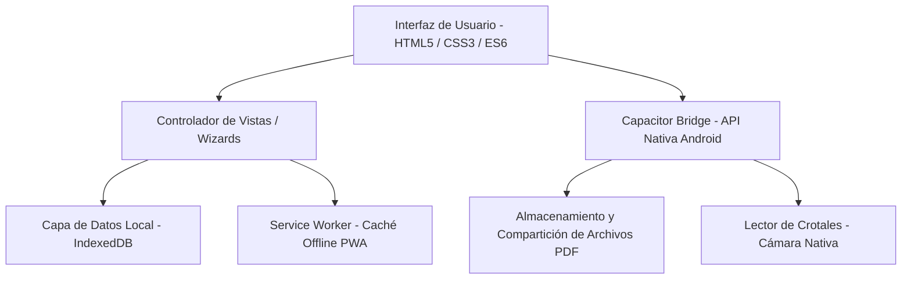

### Tecnologías Clave:
* **Frontend Core:** HTML5 semántico, CSS3 estructurado (Outfit Font System) y JavaScript ES6 modular libre de dependencias externas pesadas.
* **Persistencia:** Base de datos IndexedDB local de alta capacidad (sincronizada en segundo plano).
* **Motor Offline:** Service Worker con precarga de recursos estáticos y vistas para soporte offline del 100% de la funcionalidad.
* **Hibridación:** Capacitor v5 con plugins nativos para cámara (barcode-scanner), sistema de archivos y compartición nativa (Share API).

---

## 5. Estructura del Proyecto

```text
.
├── index.html                   # Página principal de la aplicación (SPA)
├── manifest.webmanifest         # Configuración PWA para instalación web
├── sw.js                        # Service Worker de gestión de caché offline
├── css/                         # Hojas de estilo globales
├── js/                          # Lógica y controladores de la aplicación
│   ├── database.js              # Inicialización y persistencia de IndexedDB
│   ├── icons.js                 # Biblioteca de iconos SVG vectoriales
│   ├── views/                   # Controladores de las pantallas de la SPA
│   │   ├── documentos-view.js   # Historial unificado de trámites y documentos
│   │   ├── albaranes-ventas-view.js # Historial de entregas lácteas y ventas cárnicas
│   │   ├── manuales-view.js     # Visor integrado de guías de usuario
│   │   └── wizards/             # Flujos paso a paso de tareas críticas
│   └── qa-siggan.js             # Batería de pruebas automatizadas QA
├── icons/                       # Recursos gráficos e imágenes de marca de la app
├── manual/                      # Directorio fuente de manuales en HTML
│   ├── estilo-manuales.css      # CSS centralizado de los manuales
│   └── img/                     # Capturas de pantalla de soporte ilustrativo
├── scripts/                     # Scripts auxiliares y herramientas de compilación
├── android/                     # Proyecto nativo compilable de Android Studio
└── package.json                 # Definición de dependencias y scripts de construcción
```

---

## 6. Instalación y Construcción

### Requisitos Previos:
* Node.js v18.0 o superior.
* npm v9.0 o superior.
* Android Studio (con Android SDK 33+).
* JDK 17 o superior.

### Configuración del Entorno:
1. Clonar el repositorio localmente.
2. Instalar las dependencias de Node.js:
   ```bash
   npm install
   ```

### Scripts de Compilación:
* **Construcción Web:** Compila y copia todos los archivos web necesarios al directorio de producción `www`:
  ```bash
  npm run build
  ```
* **Sincronización con Android:** Compila el proyecto web y sincroniza todos los recursos con la carpeta nativa de Android Assets:
  ```bash
  npm run cap:sync
  ```
* **Apertura en Android Studio:** Abre la consola de desarrollo de Android Studio apuntando al proyecto móvil:
  ```bash
  npm run cap:open
  ```

---

## 7. Pruebas de Calidad (QA) y Consistencia

La aplicación incluye un completo suite de diagnóstico funcional en `js/qa-siggan.js` ejecutable directamente desde la consola de desarrollador del navegador web o del dispositivo:

```js
// Ejecutar el suite completo de pruebas
await SigganQA.runAll();

// Validar la cobertura del modelo de datos de trazabilidad
await SigganQA.run("coverage");

// Limpiar registros temporales de pruebas
await SigganQA.cleanup();
```

Adicionalmente, se pueden correr chequeos específicos de la app a través del módulo de testeo básico:
* `window.QATestRunner.runAll()`: Pruebas unitarias de flujo.
* `window.QADiagnostico.run()`: Evaluación de consistencia interna del almacenamiento IndexedDB.

---

## 8. Licencia

Repositorio privado. Todos los derechos reservados. Uso exclusivo interno del proyecto Livestock Manager.
