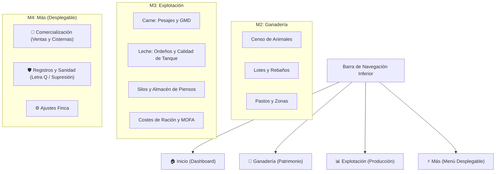

# Propuesta de Rediseño: Módulo de Explotación (Producción, Costes y Almacén)

Esta propuesta detalla la separación estructural de los bloques de gestión en **Menús Principales de Navegación** y el desarrollo específico del módulo **Explotación**, con especial detalle en la sección láctea (calidad del tanque, analíticas) y su unificación en el modo híbrido.

---

## 1. Nueva Estructura de Menús de Navegación (Bottom Nav)

Para evitar sobrecargar las vistas con 4 pestañas internas masivas, proponemos elevar los dos primeros bloques a **menús directos de la barra inferior (Bottom Nav)** y mantener el resto accesibles desde el menú contextual "Más":



---

## 2. Propuesta Detallada para el Menú "Explotación"

El menú de **Explotación** se adaptará de forma automática según la especialidad de la finca activa, mostrando layouts especializados con la estética premium característica:

### A. layout para Fincas 🥛 LECHE (Lácteo) — *Color Temático: Azul (#3b82f6)*
El apartado de leche se presenta de forma extensa, dando gran visibilidad a la calidad e higiene del tanque, que son críticos para la liquidación.

1.  **Grid de KPIs Clave (Parte Superior):**
    *   **Litros Producidos:** Total acumulado en el mes.
    *   **Calidad Media Tanque:** Nota media ponderada (Óptima / Atención / Alerta).
    *   **Extracto Seco Medio:** Grasa + Proteína de referencia.
    *   **Margen de Alimentación (MOFA):** Ingresos estimados de leche menos costes de silos.
2.  **Apartado Extenso: Calidad e Higiene de Tanque (Analíticas):**
    *   **Historial de Calidad Reciente:** Tabla resumen de las analíticas de laboratorio asociadas a cada recogida de cisterna.
    *   **Visualización de Parámetros Críticos con Indicadores Semáforo (Verde/Naranja/Rojo):**
        *   🧈 **Grasa (%)** (Umbral óptimo: $\ge 6.0\%$ en ovino, $\ge 3.7\%$ en vacuno).
        *   🥩 **Proteína (%)** (Umbral óptimo: $\ge 5.0\%$ en ovino, $\ge 3.2\%$ en vacuno).
        *   📊 **Extracto Seco Total (%)** e Extracto Seco Desgrasado.
        *   🔬 **Células Somáticas (CS/mL):** Indicador de mamitis subclínica (Alerta si $> 400.000$).
        *   🧫 **Bacterias / UFC:** Carga microbiana (Alerta si $> 100.000$ o $1.500.000$ según especie).
        *   💊 **Inhibidores de Antibióticos:** Certificación binaria (OK / **CRÍTICO: Presencia Detectada** con aviso de bloqueo de tanque).
        *   🌡️ **Temperatura (°C):** Temperatura de carga en cisterna (Óptima $\le 4^\circ\text{C}$).
3.  **Controles de Ordeño Diarios:**
    *   Historial de ordeños registrados de forma individual (por animal) o masiva (por lote).
    *   Botón directo: `➕ Registrar Control Diario` (abre el asistente rápido de ordeño).
4.  **Almacén de Silos Lácteos:**
    *   Indicador de nivel de stock visual para:
        *   *Silo A: Pienso Concentrado de Ordeño*
        *   *Silo B: Mezcla Unifeed Lactancia*
    *   Asistente rápido para registrar Cargas (compras) y Consumos diarios de ración.

---

### B. Layout para Fincas 🥩 CARNE (Cárnico) — *Color Temático: Rojo (#ef4444)*
Enfocado en el crecimiento del ganado, la conversión alimentaria y pesajes periódicos.

1.  **Grid de KPIs Clave (Parte Superior):**
    *   **Total kg Pesados:** Sumatorio acumulado de pesajes.
    *   **GMD Medio Finca:** Ganancia Media Diaria del censo.
    *   **Coste Alimentación:** Coste total de pienso consumido en el mes.
2.  **Ganancia Media Diaria (GMD) y Líderes:**
    *   Cálculo automático de GMD ($kg/\text{día}$) comparando los últimos dos pesajes de cada animal.
    *   **Panel de Campeones:** Widget "Líderes de Ganancia de Peso" (Top 3/5 animales con mayor tasa de conversión).
3.  **Historial de Pesajes Recientes:**
    *   Lista cronológica de pesajes de animales individuales o de rebaños completos.
    *   Botón directo: `➕ Registrar Peso` (abre asistente rápido).
4.  **Almacén de Silos de Cebo:**
    *   Nivel de stock de silos de cebo, recría y forrajes.
    *   Acceso directo a cargas y consumos.

---

### C. Layout para Fincas 🔄 HÍBRIDO (Mixto) — *Color Temático: Oro/Naranja (#d97706)*
El gran bloque unificado consolida la actividad física y económica, manteniendo la separación funcional por aptitud.

1.  **Grid de KPIs Consolidado:**
    *   **Margen Alimentación Global:** MOFA conjunto (Venta Carne + Retirada Leche - Gastos Silos).
    *   **Coste Piensos Total:** Sumatorio de alimentación de ambos sectores.
    *   **Eficiencia Económica:** Ratio de cobertura del coste alimentario.
2.  **Selector de Vista Interna (Tabs Rápidos):**
    *   `🥩 Sección Cárnica`:
        *   Muestra el histórico de pesajes recientes de lotes/animales de cebo.
        *   Top GMD del sector de carne.
        *   Botón rápido: `➕ Registrar Peso (kg)`.
    *   `🥛 Sección Láctea`:
        *   Muestra los controles de ordeño del lote de ordeño.
        *   **Tabla de Calidad de Tanque** con los parámetros higiénico-sanitarios (grasa, proteína, somáticas, inhibidores) detallados.
        *   Botón rápido: `➕ Registrar Ordeño (L)`.
3.  **Almacén y Silos Consolidado:**
    *   Visualización lado a lado de todos los silos de la finca (cebo, ordeño y mezcla).
    *   Botón rápido unificado `➕ Carga/Consumo` para repartir raciones a lotes de cebo u ordeño.

---

## 3. Mockup de Interfaz Premium para "Explotación" (Leche / Híbrido)

A continuación se muestra una representación del diseño visual con CSS personalizado que utilizaremos para la visualización de analíticas y calidad del tanque de leche, garantizando un aspecto de alta gama:

```
+--------------------------------------------------------------+
| 📊 Explotación, Producción, Costes, Almacén                   |
+--------------------------------------------------------------+
| KPIs:                                                        |
| [ 42.150 L ]         [ 🔬 Calidad: ÓPTIMA ]    [ 1.840 € ]   |
| Prod. Mensual          Semáforo Higiénico        Margen MOFA  |
+--------------------------------------------------------------+
| ➕ Registrar Control Diario         ➕ Nueva Carga Silo       |
+--------------------------------------------------------------+
|                                                              |
| 🔬 CALIDAD DE TANQUE (ÚLTIMAS ANALÍTICAS DE LABORATORIO)     |
| +------------+-------+--------+---------+--------+---------+ |
| | Cisterna   | Grasa | Prote. | Somát.  | UFC    | Inhib.  | |
| +------------+-------+--------+---------+--------+---------+ |
| | 22/06/2026 | 6.2%  | 5.1%   | 280k ✅ | 95k ✅ | OK ✅   | |
| | 18/06/2026 | 5.9%  | 4.9%   | 340k ✅ | 120k ✅| OK ✅   | |
| | 14/06/2026 | 6.3%  | 5.2%   | 420k ⚠️ | 80k ✅ | OK ✅   | |
| +------------+-------+--------+---------+--------+---------+ |
|                                                              |
| 🌾 INVENTARIO DE SILOS DE ALIMENTACIÓN                       |
| Silo A: Pienso Concentrado Ordeño (Cap: 10t)                 |
| [████████████████████████░░░░░░] 78% (7.800 kg)              |
|                                                              |
| Silo B: Mezcla Unifeed Lactancia (Cap: 5t)                   |
| [████████░░░░░░░░░░░░░░░░░░░░░░] 33% (1.650 kg) ⚠️ Bajo       |
+--------------------------------------------------------------+
```

---

## 4. Próximos Pasos para la Implementación

Una vez aprobada esta propuesta:
1.  **Modificar `index.html`:** Añadir el elemento de menú de **Explotación** en la barra inferior de navegación y ajustar el panel "Más".
2.  **Crear `js/views/explotacion-view.js`:** Concentrar toda la lógica del bloque 2 (pesadas, ordeños, silos y calidad de tanque) en un solo controlador de vista, liberando a `CarneView`, `LecheView` e `HibridoView` para que se enfoquen al 100% en la gestión de censo, lotes y zonas (Ganadería).
3.  **Actualizar `js/app.js`:** Añadir la ruta `#/explotacion` y enlazarla al cargador de vista.
4.  **Actualizar el Service Worker (`sw.js`):** Invalidar caché para asegurar el despliegue limpio de los nuevos ficheros.
